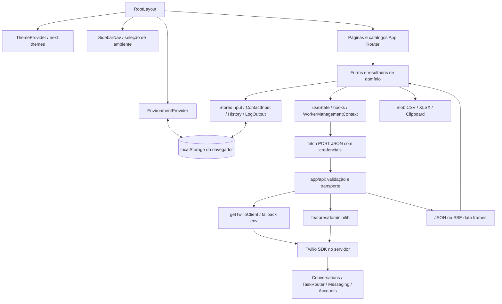

# Auditoria técnica do Switchboard

Data de conclusão: **01/10/2026**, America/Sao_Paulo. Investigação iniciada em 30/09/2026.

## Escopo, método e limites

Auditoria do **working tree atual**, incluindo alterações locais que já existiam e arquivos ainda não rastreados. Não representa exclusivamente o último commit. Foram investigados os arquivos de aplicação, componentes, regras de negócio, handlers, tipos, testes, configurações, ambos os lockfiles, documentação, recursos públicos e configuração local de ferramenta. `node_modules` e `.next` foram considerados artefatos, não código autoral. Nenhuma recomendação foi implementada. A única adição autoral desta etapa é este documento; testes e build regeneram artefatos ignorados.

**Legenda:** “observado” indica evidência em código ou comando; “inferência” identifica consequência provável da implementação; “desconhecido” indica ausência de evidência suficiente. As avaliações visuais são estáticas, baseadas em JSX/CSS, não uma inspeção de screenshots. Não houve sessão de navegador, teste em dispositivos, medição de contraste, profiling, teste de penetração nem chamada real à Twilio. Os testes usam mocks. Não foram usados ou transcritos segredos reais.

Foram traçados imports, referências, entradas do framework, imports dinâmicos e carregamento por strings nos testes antes de avaliar utilização. Não foi identificado arquivo autoral de componente/lib inteiramente sem referência pelo levantamento estático. Isso não garante ausência de exports ou propriedades redundantes. As rotas legadas são utilizadas como compatibilidade, não devem ser confundidas com código morto.

### Evidências executadas

| Verificação | Resultado observado |
| --- | --- |
| `npm test` | **118 testes, 118 aprovados**, zero falhas, cancelamentos ou testes ignorados |
| `npm run typecheck` | Aprovado, TypeScript strict ativo |
| `npm run lint` | **17 erros**, zero warnings; todos `react-hooks/set-state-in-effect` |
| `npm run build` | Aprovado, Next 16.1.7/Turbopack; tentativa inicial falhou ao baixar Geist/Geist Mono no sandbox, repetição com rede aprovada concluiu |
| `npm ls --depth=0` | Versões instaladas identificadas; cinco pacotes auxiliares marcados `extraneous` |
| `npm audit --json` | **9 pacotes com alertas:** 1 crítico, 5 altos, 3 moderados; consulta ao registro, sem `audit fix` |
| Contagem de fontes | **25 `page.tsx` + 15 handlers `route.ts`**; além da página 404 gerada pelo framework |

O build passar não significa que lint passa, nem comprova integração com uma conta Twilio. Não existe relatório de cobertura percentual. A severidade de um aviso npm não comprova que todas as condições de exploração estejam presentes no produto.

## 1. Executive Summary — resumo executivo

Switchboard é um dashboard operacional interno em pt-BR para suporte/operações executarem consultas e alterações na Twilio sem scripts. O sistema opera Conversations, Tasks, Workers, Workflows, configurações de endereços e classificação de WhatsApp Senders. Também mantém ambientes de credenciais, contatos e autocomplete localmente.

A arquitetura é um único projeto Next.js App Router: páginas de servidor compõem interfaces React de cliente; estas enviam POST ao backend do próprio Next; handlers criam um cliente Twilio e delegam para módulos de domínio. Operações longas respondem por SSE sobre `fetch`, não por `EventSource`. O backend não possui banco de dados, fila de jobs ou persistência de credenciais. Dados operacionais permanecem na Twilio; preferências e históricos ficam no navegador.

Há 25 URLs de página: 6 entradas de catálogo/home, 13 páginas de ferramentas/configuração, 5 redirects legados e 1 alias de consulta de Task. Existem 15 endpoints POST, dos quais 6 usam SSE. Não há autenticação de usuário da aplicação, RBAC ou autorização de operações implementados. Credenciais Twilio determinam o acesso externo; a seleção de ambiente é uma conveniência da interface, não uma barreira de segurança no servidor.

Pontos positivos observados: camadas de domínio reconhecíveis, strings centralizadas, validação forte nos fluxos de consulta unificada/fechamento de Conversations e features de Worker, proteção contra respostas tardias na consulta unificada, erros externos sanitizados, componentes de feedback compartilhados, testes que caracterizam limitações de SSE e merge cuidadoso de features de Worker.

Principais achados: avisos de segurança nas dependências; possível uso não autorizado das credenciais do servidor quando o fallback está configurado e endpoints estão expostos; validação inconsistente de bodies; cancelamento que geralmente interrompe apenas o cliente; consultas/históricos sem isolamento uniforme por ambiente; resultados de Numbers que silenciam falhas; componentes extensos; lacunas de acessibilidade do menu mobile; ausência de cobertura em navegador. Reconstruir apenas o JSX perderia regras atualmente alojadas nos formulários, hooks e exportadores.

**Recomendação para a futura etapa:** preservar os contratos descritos aqui, criar testes de caracterização das lacunas críticas e reconstruir por fluxo. Bugs atuais devem ser tratados em mudanças separadas e explícitas, não incorporados silenciosamente ao redesign.

## 2. Architecture — arquitetura

### 2.1 Camadas observadas

| Camada | Papel real | Observações |
| --- | --- | --- |
| `app/layout.tsx` | Idioma, fontes, metadata global, tema, ambiente, sidebar, barra de navegação e `main` | Layout global de servidor com providers de cliente |
| `app/page.tsx`, `app/(pages)` | Home, catálogos, wrappers, leitura de query e redirects | Catálogos têm markup; páginas operacionais importam formulários |
| `features/*/components` | Inputs, validação cliente, estado, chamadas POST, resultados, histórico e exportações | Regras de comportamento relevantes vivem nesta camada |
| `app/api` | Parse/validação, fábrica Twilio, orquestração, serialização JSON/SSE | Verificação de conta chama SDK diretamente; nem toda rota valida formatos |
| `features/*/lib` | Chamadas SDK, transformação de recursos e regras operacionais | Não acessa localStorage; há também utilitários puros de apresentação/CSV no domínio |
| `lib` | Erros, constantes, strings, storage auxiliar, SSE, tipos de catálogo e classes CSS | Sem camada HTTP cliente compartilhada |
| `components` | Primitivos e composição transversal | Autocomplete/contatos também possuem efeitos de persistência |

Não há backend independente, GraphQL, ORM, autenticação de sessão, WebSocket, Redux, React Query, Zustand, Service Worker ou Server Actions autorais identificados. Não há middleware/proxy autoral, `error.tsx` ou `global-error.tsx`. Exceções não capturadas dependem do framework.

### 2.2 Mapa conceitual de dependências



Relações que precisam sobreviver:

- Consulta Conversation → `ConversationForm` → `ConversationResult` → `useConversationQuery` → `/fetch` e `/history` → Conversations/Participants/Messages. `ConversationMessages` é importado dinamicamente e usa filtros/CSV separados.
- Busca por participante → `ContactInput` + histórico global + paginação → `/fetch-by-participant` → `participantConversations.page` → link para consulta com SID/query.
- Gerenciamento de Workers → contexto compartilhado de Workspace/tab/Worker → três formulários → três endpoints independentes → resolução por WK ou friendlyName → fetch/merge/update de atributos.
- Operações em lote → confirmação → `AbortController` → POST → lib de domínio → frames → `consumeSseStream` → logs/contadores/histórico. Somente features de Worker leva `AbortSignal` até a lib.
- Numbers → duas fontes Twilio → deduplicação/classificação → filtros/ordenação cliente → exportação global dos resultados.

### 2.3 Execução e distribuição

`next.config.mjs` contém apenas `serverExternalPackages: ["twilio"]`. Não há `output: "export"`, container, infraestrutura de deploy ou pipeline CI no repositório. Um deploy precisa executar backend Node para os POSTs; copiar HTML estático não conserva o sistema. Ambiente/OS de produção, TLS, reverse proxy, autenticação no perímetro e timeout de hospedagem são **desconhecidos**.

## 3. Technology Stack — tecnologias e versões

Versões declaradas não são necessariamente as versões instaladas. A coluna instalada deriva de `npm ls` nesta máquina, não de suposição sobre a produção.

| Tecnologia | `package.json` | Instalada | Uso |
| --- | --- | --- | --- |
| Next.js / eslint-config-next | `16.1.7` | `16.1.7` | App Router, servidor, Turbopack e regras ESLint |
| React / React DOM | `^19.2.4` | `19.2.8` | UI e SSR |
| TypeScript | `^5.9.3` | `5.9.3` | Tipagem strict, compilação e loader de testes |
| Tailwind / PostCSS plugin | `^4.2.1` | `4.3.3` | CSS baseado em tokens/utility classes |
| PostCSS | `^8` | `8.5.27` no nível raiz | Pipeline CSS; há cópia transitiva diferente no Next |
| radix-ui | `^1.4.3` | `1.6.7` | Tabs, AlertDialog, DropdownMenu, Tooltip, Slot |
| shadcn | `^4.2.0` | `4.20.1` | Configuração de UI e CSS importado por globals |
| Lucide React | `^1.7.0` | `1.40.0` | Ícones |
| next-themes | `^0.4.6` | `0.4.6` | Tema system/light/dark |
| Twilio | `^5.13.1` | `5.13.1` | SDK REST servidor |
| xlsx | `^0.18.5` | `0.18.5` | Exportação de Numbers em Excel |
| class-variance-authority | `^0.7.1` | `0.7.1` | Variantes Button/Badge |
| clsx / tailwind-merge | `^2.1.1` / `^3.5.0` | `2.1.1` / `3.6.0` | `cn()` |
| tw-animate-css | `^1.4.0` | `1.4.0` | Animações de UI |
| ESLint | `^9.39.4` | `9.39.5` | Análise estática |
| Prettier / plugin Tailwind | `^3.8.1` / `^0.7.2` | `3.9.6` / `0.7.4` | Formatação |
| Tipos Node/React/DOM | `^25.5.0` / `^19.2.14` / `^19.2.3` | `25.9.5` / `19.2.18` / `19.2.7` | Tipagem; tipos Node 25 não equivalem ao runtime mínimo |

Runtime exigido: Node `>=22`; auditoria executada com Node **22.23.2** e npm **10.9.8**. Projeto ESM (`type: module`), privado, versão `1.0.0`.

### 3.1 Gerenciadores, lockfiles e scripts

README prioriza Bun e aceita npm. Há **`bun.lock` e `package-lock.json` rastreados**, sem campo `packageManager`. O lock npm versão 3 corresponde ao manifesto atual. O Bun tem workspace chamado `next-app`, inclui `@eslint/eslintrc` e não registra `xlsx` na lista raiz: **divergência observada**, sem executar uma reinstalação para medir o efeito.

| Script | Comando | Contrato |
| --- | --- | --- |
| `dev` | `next dev --turbopack` | Servidor local, README orienta `localhost:3000` |
| `build` | `next build` | Build de produção, TypeScript, geração de páginas |
| `start` | `next start` | Servir build com backend |
| `lint` | `eslint` | Sem auto-fix no comando |
| `format` | `prettier --write "**/*.{ts,tsx}"` | Modifica fontes; **não executado** nesta auditoria |
| `typecheck` | `tsc --noEmit` | Pode gerar cache incremental ignorado |
| `test` | `node --test tests/*.test.mjs` | Testes Node, sem navegador |

Desenvolvimento documentado: instalar dependências, iniciar dev, abrir dashboard e cadastrar ambiente. Não há script de seed/migration/release/coverage/e2e. Fontes são `Geist` e `Geist_Mono` via `next/font/google`: build depende de obtê-las quando não há cache. `.prettierrc` usa LF, sem ponto e vírgula, aspas duplas, 2 espaços e plugin Tailwind. ESLint usa configurações Core Web Vitals e TypeScript; não ignora a regra que atualmente falha.

### 3.2 Configurações de ambiente

Somente **`TWILIO_ACCOUNT_SID` e `TWILIO_AUTH_TOKEN`** são lidas pelo código autoral. Não há `NEXT_PUBLIC_*` para credenciais. `getTwilioClient` escolhe cada valor por `argumento ?? process.env...`: ausência permite fallback, string vazia impede fallback e gera erro. Não há validação central do par; algumas rotas validam antes, outras não. É possível combinar um valor do body com outro do ambiente em rotas permissivas.

`.env*.local` está ignorado; não há template `.env.example` encontrado. Valores reais e configuração efetiva do servidor não foram determinados. Não há configuração de Twilio Region/Edge, scopes específicos, timeout ou retry automático da fábrica.

## 4. Project Structure — estrutura do projeto

```text
app/
  layout.tsx, globals.css, page.tsx, loading.tsx
  (pages)/
    conversations/  catálogo, consult, fetch-by-participant, close, legados
    taskrouter/     catálogo, workers, search/fetch-task, workflows, filtros, encerramento
    numbers/        catálogo e list
    flex/           catálogo e create-address-config
    settings/       catálogo, environments, contacts, variables
  api/
    conversations/  close, fetch, fetch-by-participant, history
    taskrouter/     8 operações
    environments/verify
    numbers/list
    flex/create-address-config
features/
  conversations/    components, lib, types.ts, tools.ts
  taskrouter/       components, lib, types.ts, tools.ts
  numbers/          components, lib, types.ts, tools.ts
  flex/             components, lib, types.ts, tools.ts
  environments/     context.tsx, storage.ts, components
  contacts/         components (persistência em lib/contacts.ts)
  variables/        components (persistência em lib/variables.ts)
components/
  ui/               9 módulos primitivos
  ações, input actions, autocomplete, contatos, histórico, logs, shell e feedback
lib/                utilitários transversais, strings, constantes, erros e cliente Twilio
tests/              9 suítes .test.mjs, loaders/harness e fixture
public/             favicons, ícones PNG e manifest
docs/               diretório presente, sem arquivos nesta cópia
README.md, CLAUDE.md, AGENTS.md
package.json, package-lock.json, bun.lock
next.config.mjs, tsconfig.json, eslint.config.mjs, postcss.config.mjs
components.json, .prettierrc, .prettierignore, .gitignore
.claude/settings.local.json  permissões locais de ferramenta, não config do produto
```

`CLAUDE.md` e `AGENTS.md` referenciam `docs/fase-2d-sse.md`; CLAUDE também referencia auditorias de textos em `docs`. **Esses arquivos não existem na cópia auditada.** As semânticas foram confirmadas no código e nos testes, não nesses documentos ausentes.

Manifest tem `name` e `short_name` vazios, cores brancas e `display: standalone`; isso não demonstra suporte offline/PWA completo. Não foram encontrados analytics, fontes locais, guia visual, Storybook ou screenshots de produto.

## 5. Functional Map — mapa funcional

| Área | Funcionalidades efetivas | O que não foi encontrado |
| --- | --- | --- |
| Ambientes | Criar/editar/excluir, testar conta, escolher ativo, revelar/ocultar token, visualizar valores salvos | Login da aplicação, convite, compartilhamento/sincronização servidor |
| Contatos | CRUD nome/número; seleção, salvamento e exclusão nos inputs de telefone | Validação E.164, import/export de contatos, busca na página de gestão |
| Autocomplete | Salvar/selecionar/excluir sugestões, gerenciar valores por ambiente | Sincronização entre abas/instâncias, validação de domínio dos valores na gestão |
| Conversations | Detalhes/participantes, mensagens, filtros, CSV, busca WhatsApp por número com carregar mais, encerramento em lote | Envio manual pelo chat, edição de mensagens, download do binário de anexo, paginação de mensagens antigas |
| Tasks | Consulta por WT ou telefone, atributos/estado/canal/prioridade/idade, copiar SID | Atribuir/cancelar uma Task individual por card, filtro/ordenação/paginação dos cards |
| Workers | Detalhes/atividade/skills/níveis; adicionar skill; ativar/desativar feature de plugin | Remover skill, criar Worker, alterar atividade, administração de permissões |
| Workflows | Criar com regras CSV; acrescentar filtro a vários workflows | Editor completo, edição/exclusão geral, preview/dry-run servidor |
| Tasks por fila | Cancelar pending/reserved; mensagem e fechamento de Conversation associada | Rollback, job persistido, retomada, seleção manual por Task |
| Numbers | Classificar senders, buscar nome/número, filtro serviço, ordenar nome/serviço, CSV/XLSX | Compra/portabilidade de números, consulta IncomingPhoneNumbers, prova de integração Programmable Chat |
| Flex | Criar Address Configuration com Studio/webhook/default | Gestão de plugins instalados; editar/excluir configuração; validar disponibilidade real de todos os canais |

Modais de confirmação existem também para consultas de participante, Worker, Tasks e Numbers, não apenas escritas. Exclusões de configurações locais usam confirmação inline por item. Notificações são inline/status/logs; não há toast library ou central de notificações. Menus Radix servem seleção de ambiente/exportação; sugestões são listas autorais. Tabela principal está em Numbers; outras entidades usam cards/listas.

## 6. Routes and Pages — rotas e páginas

Todas as páginas autorais são Server Components. O grupo `(pages)` não aparece na URL. Não existem segmentos dinâmicos `[id]`; SID e tab chegam por query onde indicado. `app/layout.tsx` fornece metadata herdada; home e três redirects de Worker não exportam metadata própria (divergência da regra de todas as páginas).

| URL | Entrada / finalidade | Query e comportamento |
| --- | --- | --- |
| `/` | `DashboardPage`, 4 cards de áreas | Conversations, TaskRouter, Settings, Numbers; **Flex não tem card na home**, mas existe na sidebar |
| `/conversations` | Catálogo `conversationsTools` | 3 ferramentas |
| `/conversations/consult` | `ConversationForm` | `sid` string; `tab=messages`, demais valores → details; SID válido inicia busca |
| `/conversations/fetch-by-participant` | `FetchByParticipantForm` | Input local de telefone; não lê query |
| `/conversations/close` | `CloseForm` | Fechamento por telefone |
| `/conversations/fetch` | Redirect | Preserva `sid` se string → `/conversations/consult?tab=details&sid=...` |
| `/conversations/history` | Redirect | Preserva `sid` se string → `/conversations/consult?tab=messages&sid=...` |
| `/taskrouter` | Catálogo `taskrouterTools` | 5 ferramentas |
| `/taskrouter/workers` | `WorkerManagementForm` | `tab=skills` ou `features`; demais → details |
| `/taskrouter/search-tasks` | `SearchTasksForm` | Modo inicial sid; não lê query |
| `/taskrouter/fetch-task` | Mesmo `SearchTasksForm` | Alias, não redirect; não preenche WT de query |
| `/taskrouter/create-workflow` | `CreateWorkflowForm` | CSV |
| `/taskrouter/add-particular-filter` | `AddParticularFilterForm` | Pares WW/WQ |
| `/taskrouter/cancel-queue-tasks` | `CancelQueueTasksForm` | Workspace/fila/mensagem |
| `/taskrouter/fetch-worker` | Redirect | `/taskrouter/workers?tab=details`; não conserva outras queries |
| `/taskrouter/assign-workers` | Redirect | `/taskrouter/workers?tab=skills` |
| `/taskrouter/update-worker-feature` | Redirect | `/taskrouter/workers?tab=features` |
| `/numbers` | Catálogo `numbersTools` | 1 ferramenta |
| `/numbers/list` | `ListNumbersForm` | Sem busca automática |
| `/flex` | Catálogo `flexTools` | 1 ferramenta |
| `/flex/create-address-config` | `CreateAddressConfigForm` | Cancelar navega `/flex` |
| `/settings` | Catálogo local `Tool[]` | 3 gestores |
| `/settings/environments` | `EnvironmentsManager` | Sem necessidade de ambiente ativo |
| `/settings/contacts` | `ContactsManager` | Global ao navegador |
| `/settings/variables` | `VariablesManager` | Exige ambiente ativo |

Loading de rota global via `app/loading.tsx`; skeletons específicos em consulta Conversation, participante e Workers. Não há roteamento configurado em arquivo central: filesystem é a fonte. Sidebar e `features/*/tools.ts` são registros distintos; ambos devem ser conservados. `Tool.available` suporta “Em breve”, mas os catálogos atuais só registram `true`.

## 7. User Flows — fluxos do usuário

### 7.1 Preparar e selecionar ambiente

1. Entrada `/settings/environments` ou link do aviso/selector. `EnvironmentsManager` compõe `EnvironmentForm`, `EnvironmentCard` e `MaskedToken`.
2. Estado: lista e ativo no provider; adicionar/editar/excluir no gestor; form/name/SID/token/erros/mostrar token/teste no formulário.
3. Validar nome não vazio, AC + 32 hex e token de **32 caracteres** (cliente não exige hex). Salvar faz trim e gera UUID na criação. Não é obrigatório testar antes de salvar; criar não seleciona automaticamente.
4. Testar envia `{accountSid,authToken}` a `/api/environments/verify`, que faz fetch da conta. Retorno `{ok:true}` ou erro seguro; estados idle/loading/success/error.
5. Selecionar card ou dropdown atualiza contexto/storage. Excluir ativo limpa o id; não remove históricos/autocomplete órfãos daquele ambiente.
6. Resultado esperado: operações seguintes usam credenciais do selecionado. Limitação: teste em andamento não é abortado ao editar credenciais; resposta anterior pode restaurar feedback de sucesso após uma alteração.

### 7.2 Consultar Conversation: detalhes, participantes e mensagens

1. Entrada direta `/conversations/consult`, link de card por participante ou redirects legados. SID recebido válido inicia consulta automática; SID digitado exige submit.
2. `ConversationForm` é segmentado por `activeEnvironment.id`; o resultado recebe key SID/revision. `ConversationResult` mantém tab e `messagesRequested`. `useConversationQuery` mantém detalhes/erros/mensagens e tentativas independentes.
3. Input CH + 32 hex. POST `/api/conversations/fetch` sempre; POST `/api/conversations/history` quando Messages for solicitado pela primeira vez. Mesmo entrada pela tab Messages carrega também detalhes/participantes.
4. Detalhes: fetch Conversation e participantes em paralelo, limite 200. Exibe SID/estado traduzido/datas/Messaging Service SID/atributos e lista de participantes com binding/identidade/proxy/datas.
5. Mensagens: lê Conversation, busca até 1.001 mensagens descendentes, mantém 1.000 mais recentes e inverte para ordem cronológica. `hasMore` avisa truncamento, sem botão de paginação.
6. Filtros locais por texto do body, autor exato, datas inclusivas em horário local do navegador. Filtros e mensagens permanecem ao trocar tab (`forceMount`). Clear limpa filtros. Refresh em detalhes remonta resultado, recarrega e limpa cache/filtros. Cada tab tem retry próprio.
7. `isCustomerMessage` usa participant SID e binding.address; fallback somente por endereço conhecido com prefixo WhatsApp normalizado. Proxy não é cliente. Sem participantes, alinhamento começa à esquerda e pode atualizar após detalhes. Autor original, texto, data, metadados de anexos e Message SID são preservados.
8. Copiar Message SID usa clipboard, tooltip por hover/foco e status de sucesso/erro; sem texto, mostra fallback. Anexos são nomes/tipos/tamanhos, sem link de download.
9. Exporta **somente mensagens filtradas e carregadas**, CSV com BOM UTF-8, `;`, CRLF, células entre aspas, aspas duplicadas e defesa de fórmula nos valores iniciados por `= + - @`.
10. Históricos: lembra SID no submit/reuso, não depende de API ter sucesso; entrada automática de query não chama `remember`. Cinco SIDs deduplicados por ambiente, sem conteúdo de mensagem. Novas buscas/remount abortam e descartam resposta tardia; credenciais alteradas no mesmo id reiniciam efeitos, mas resultados já carregados não são explicitamente zerados.

### 7.3 Buscar Conversations por número

Entrada `/conversations/fetch-by-participant`. Form mantém phone/stateFilter/loading/error/results/history/confirmOpen/token/loadingMore. `ContactInput` permite usar/salvar contatos globais. Cliente aceita **somente dígitos**, sem tamanho mínimo: constrói `whatsapp:+55${phone}`. Não aplica a normalização mais ampla do formulário de fechamento.

Submit valida dígitos e abre confirmação com endereço/ambiente/filtro. POST `/api/conversations/fetch-by-participant` recebe address; Twilio retorna páginas de 20. Ordenação active primeiro e updated desc **dentro de cada página**. Filtro all/active/inactive/closed roda no conjunto carregado, não no servidor. Cards mostram SID, nome, estado bruto, datas e identidade; ação Consultar leva `sid` + `tab=details` à consulta unificada.

Carregar mais passa `pageToken`, concatena e mantém filtros. Contagens são de registros carregados; histórico registra só tamanho da primeira página e filtro selecionado. Reuso do histórico preenche telefone/filtro e busca diretamente, sem o modal. Vazio geral e vazio filtrado são distintos e podem ainda apresentar carregar mais. Não há abort ou deduplicação de cards na concatenação.

**Risco observado:** `loadMoreResults` usa phone e ambiente atuais, não snapshot da busca que gerou token; input é editável fora do loading inicial. Trocar telefone/ambiente antes de carregar mais pode combinar cursor e endereço/credenciais diferentes. Há também concorrência possível entre uma paginação e nova busca.

### 7.4 Encerrar Conversations por número

Entrada `/conversations/close` → `CloseForm` + `ContactInput`, WarningBadge, confirmação destrutiva, logs/progresso/resumo/histórico. Estado inclui phones de 1 a 10 linhas, fieldErrors, status, abortRef, summary e progress. Filtra vazios, mas não deduplica números.

Cliente e servidor usam `normalizeClosePhone`: aceita DDD+número de 10/11 dígitos, país 55 com/sem `+`, prefixo WhatsApp e espaços/parênteses/hífens. Não adiciona/remove dígitos de assinante. Busca endereço exato `whatsapp:+55...`, não identidade chat, SMS ou proxy.

POST `/api/conversations/close` valida body/par/formatos/lote. Lib lista **todas as páginas** de participantConversations com pageSize 50, filtra somente `active`, atualiza state `closed`, sequencial por número/conversa. Retry 3 tentativas/2 segundos para busca/update. Sem ativo → warning, zero erro. Falha de busca conta erro e não vira vazio. Final SSE `{done:true,totalClosed,totalErrors}`. Progresso conta números iniciados, não quantidade de Conversations já fechadas.

Efeito irreversível operacional: estado remoto é alterado; não há reabertura/rollback. Cancelar aborta fetch/leitura do cliente, **não cancela o loop servidor**. Resumo/histórico só são produzidos pelo final; histórico guarda contadores, não lista de telefones, e não é clicável. `clearAll` limpa formulário e feedback; limpar histórico remove apenas a chave local.

### 7.5 Consultar Task por SID ou telefone

Entrada `/taskrouter/search-tasks` ou `/taskrouter/fetch-task`; `SearchTasksForm` possui modos sid/phone, workspace, valor, loading/erro/fieldErrors/results/history/modal. Troca de modo limpa inputs/resultados/erros; botões de modo continuam utilizáveis durante requisição.

Cliente exige Workspace WS + 32 hex, WT + 32 hex no modo SID; telefone só precisa ser não vazio. Confirma ambiente e valor. POST `/fetch-task` → `{task}`; `/search-tasks` → `{tasks,phone}`. Busca telefone remove prefixo **case-sensitive** `whatsapp:`, espaços/hífens/pontos/parênteses e adiciona `+` se ausente, sem inserir país 55. Filtro Twilio `from == "<phone>" OR from == "whatsapp:<phone>"`; limite 1.000, sem cursor/truncamento visível.

Cards exibem WT, copiar SID, canal inferido (quando conhecido), status bruto, prioridade, idade formatada, nome de workflow/fila, data criada e JSON de atributos. Canal privilegia `attributes.from` sobre `taskChannelUniqueName`; `whatsapp:` → WhatsApp, +/dígitos → voz, fallback `voice`, senão unknown.

Reuso histórico restaura modo/valor/workspace e refaz consulta sem modal. Entradas legadas sem workspace usam o atual. Erros são inline, estado vazio no telefone é explícito. Não há filtro/ordenação/paginação/exportação de Tasks. Sem abort/ignore-late-response, troca de modo/ambiente pode deixar resultado de requisição anterior.

### 7.6 Gerenciar Workers e transferir resultado a uma operação

Entrada `/taskrouter/workers?tab=...`. `WorkerManagementForm` + contexto possuem workspace/tab/selectedWorkerSid. Três forms `forceMount` permanecem montados para conservar inputs/resultados/logs. Tab usa Radix; mudar tab faz `window.history.replaceState` preservando outras queries. Workspace é único no topo; campos/cabeçalhos internos são escondidos por seletores CSS `data-worker-*`.

Detalhes (`FetchWorkerForm`): cliente valida Workspace, identificador não vazio; abre modal e envia `{workspaceSid,identifier}` a `/api/taskrouter/fetch-worker`. `resolveWorker`: WK válido → fetch direto, 404 → undefined; demais valores → `workers.list({friendlyName:identifier,limit:1})`. O “e-mail” é na prática busca de **friendlyName**, não filtro de atributo email. Retorna primeiro match, sem detectar ambiguidade.

Resultado: SID, friendlyName, atividade, skills/níveis se routing reconhecido, datas created/updated/statusChanged e atributos completos. Botões Adicionar skill/Configurar plugin selecionam Worker e abrem tab correspondente; chaves dos forms de escrita mudam com selectedWorkerSid. Histórico global restaura workspace/identificador e consulta novamente.

Workspace compartilhado **não é bloqueado** quando um form está executando; trocar tab/Worker/ambiente não oferece uma política global de execução. Requests usam valores capturados no início. Isso é relevante para evitar mostrar o contexto atual como se fosse o alvo de uma operação já iniciada.

### 7.7 Adicionar skill a Workers

Tab skills, redirects antigos e composição `AssignWorkersForm`. Inputs: workspace, skill, nível opcional, até 10 Workers; vazio é ignorado, identificadores deduplicados após trim. UI valida Workspace; não valida email/WK estritamente. Nível é input numérico 0–5 e também clamped antes de envio; API apenas faz `Number(level)` sem verificar finitude/faixa.

Confirma skill/quantidade/workspace, WarningBadge. POST `/api/taskrouter/assign-workers` usa campo **`emails`**, embora aceite WK e friendlyName. Resolve sequencialmente, retry de busca/update. Merge mantém atributos raiz, acrescenta skill se ausente em `routing.skills`; nível informado escreve `routing.levels[skill]`, ausente não sobrescreve nível existente (o merge pode criar containers vazios). Worker não encontrado é skipped; falha é erro; pausa de 100ms após update. Não é uma API de associação explícita a TaskQueue.

Logs, progresso, resumo `{totalUpdated,totalSkipped,totalErrors}` e histórico informativo. Cancelamento cliente apenas. Atributos são parseados/cast sem guards equivalentes à feature; atualizações usam snapshot e podem sobrescrever mudanças concorrentes de outros sistemas.

### 7.8 Habilitar/desabilitar feature de plugin no Worker

Tab features → `UpdateWorkerFeatureForm` + `useUpdateWorkerFeature`. Inputs WS válido, 1–10 identificadores WK/email, nome começando com letra e alfanumérico/underscore até 100 caracteres; rejeita `constructor`, `prototype`, `__proto__`; boolean enabled deve preservar `false`.

Confirma feature/boolean/quantidade/workspace/ambiente e alerta de não reversão. POST `/api/taskrouter/update-worker-feature` mantém nome de campo **`workerSids`**, mesmo aceitando emails. Deduplica. `mergeWorkerFeature` exige objetos em atributos/config_overrides/features/feature; cria containers ausentes e preserva outras propriedades em todos os níveis. Estrutura inválida não é substituída nem escrita. Resolve worker/fetch e update sequenciais, continua após falha, **não repete writes automaticamente**.

Abort na desmontagem e botão cancel; handler propaga request abort/cancel do stream à lib, checa antes de próximas escritas. Update já enviado pode terminar; cancelamento não desfaz. Hook valida frames e exige `done:true`; erros de itens tornam status error, logs descrevem resultado parcial. Reader release em finally. Não há histórico persistido nem banner/progressbar dedicados (progress é emitido mas não armazenado pelo hook).

### 7.9 Criar Workflow por CSV

Entrada `/taskrouter/create-workflow` → `CreateWorkflowForm`. Inputs Workspace/nome/arquivo `.csv`, sem limite autoral de bytes/linhas. Cliente valida WS e existência de arquivo, abre confirmação, lê `File.text()` e envia **texto em JSON**, não multipart/upload binário. WarningBadge, SSE, logs, resultado SID/nome/quantidade e histórico informativo.

Lib lista filas, mapeia friendlyName → SID; nomes repetidos ficam com o último. CSV usa `;`, headers exatos `Regra de Negócio` e `Fila Twilio`, trim, sem parser de aspas/linhas multilinha. Ignora linhas vazias/incompletas, fila `Fechar`/`-` e regra `-`; deduplica par regra/fila. Regra igual em filas distintas continua como filtros separados na ordem do CSV.

Fila ausente aborta antes de criar workflow. Se CSV tiver menos de duas linhas, retorna rows vazio **antes** de validar headers e ainda pode criar workflow sem filtros. Para cada linha válida: expressão `regraDeNegocio IN ['<regra>']`, cinco targets para a fila: chat assigned_tasks ==0, <=1, <=2, <=3, todos com `skip_if: "1==1"`; por fim target só com queue. Fila `EVERYONE` vira default_filter se encontrada; ausência gera warning e omite default_filter. Uma chamada create gera workflow.

Erros esperados CSV são AppError seguro em final SSE; cancelamento somente cliente. **Bug caracterizado pelos testes:** erro final sem workflowSid põe status error, mas término normal da leitura depois muda para done. Logs retêm erro, resumo não aparece sem SID. Cancelar durante `File.text()` ocorre antes de abortRef estar criado e não impede a continuação.

### 7.10 Acrescentar filtro a Workflows

Entrada `/taskrouter/add-particular-filter` → `AddParticularFilterForm`. Inputs WS, filterName e até 10 linhas WW/WQ; pares vazios ignorados, incompletos/formatos inválidos acusam erro. `pendingEntries` conserva snapshot dos pares confirmados, enquanto workspace/nome são lidos no submit. Confirma quantidade e regra; WarningBadge.

POST `/api/taskrouter/add-particular-filter`: backend requer entradas não vazias com strings, **não impõe limite 10 nem regex WS/WW/WQ**. Lib fetch e parse configuração por workflow; sem task_routing → erro daquele item. Filtro existente por nome case-insensitive em `filter_friendly_name` ou `friendly_name` → skipped. Acrescenta filtro ao fim, preserva configuração/default/targets existentes, com os mesmos 5 targets e expressão do fluxo CSV. Update sequencial, falhas continuam o lote, sem retry explícito. Final traz `{totalAdded,totalSkipped,totalErrors}`; zero added/skipped → status error; resultados mistos conservam contadores. Histórico informativo, sem reexecutar escrita. Cancelamento somente cliente.

### 7.11 Encerrar Tasks por fila

Entrada `/taskrouter/cancel-queue-tasks` → inputs WS/nome exato fila/mensagem (pré-preenchida), `StoredTextarea`, WarningBadge/confirmação destrutiva, abort/logs/progresso/resumo/histórico.

Cliente exige mensagem não vazia e WS; servidor aceita ausência/branco da mensagem e usa `DEFAULT_CLOSE_MESSAGE` de strings. Lista até **1.000 Tasks** por taskQueueName. Somente pending/reserved são elegíveis; assigned/wrapping/completed/canceled e qualquer outro/null são skipped. Processamento em lotes de **5 simultâneos**, apesar da regra documental preferir sequencial; esse comportamento é explícito no código.

Para cada elegível: (1) cancelar Task com reason localizado; falha bloqueia mensagem/fechamento; (2) extrair SID por prioridade conversationSid → conversation_id → channelSid e validar CH; sem CH válido cancelamento basta; (3) enviar mensagem com body; (4) fechar Conversation mesmo se envio falhar. Retry 3/2s em list/cancel/message/close. Não busca estado remoto atual da Conversation antes de enviar.

`totalSuccess` significa **Task cancelada**, não sucesso em todas as ações associadas. Falhas de mensagem/fechamento são warnings e ainda contam success. Se várias Tasks apontarem à mesma Conversation, não há deduplicação/serialização por CH: pode haver mensagens repetidas/conflitos. Status foi fotografado na listagem e pode mudar antes do update.

Progresso conta Tasks processadas; final totalSuccess/Skipped/Errors. Cancelar cliente não para servidor. Resumo informativo não reexecuta; limite de 1.000 não tem cursor nem aviso claro, embora confirmação diga “todas”.

### 7.12 Classificar e exportar WhatsApp Senders

Entrada `/numbers/list`; estado loading/error/results/modal/filtro/busca/ordenação. Sem fetch automático, precisa confirmar ambiente. POST `/api/numbers/list` usa credenciais; lib faz `Promise.allSettled` de addressConfigurations (limite 1.000) e Messaging V2 ChannelsSenders channel whatsapp.

Normalização remove prefixo whatsapp case-insensitive e espaços. Dedup por telefone: primeira configuração Conversations prevalece; sender restante vira **rótulo heurístico `Programmable Chat`**, sem chamada ao Programmable Chat para comprovar. AddressConfigurations não é filtrado por type; pode incluir endereço não WhatsApp.

Resultados: tabela com friendlyName/SID, telefone e serviço. Busca contém nome/número case-insensitive; filtro por serviço; sort asc/desc por nome/serviço, locale pt-BR, initial friendlyName asc. Sem paginação, tabela scroll/sticky header. Atualizar refaz fetch e conserva filtros/sort. Vazio da API e vazio filtrado são distintos.

Export dropdown CSV ou XLSX usa **`results` inteiro**, não displayedResults nem ordenação visual. CSV BOM, vírgula, LF; friendlyName escapado com aspas, demais células sem escaping uniforme/defesa de fórmula. XLSX json_to_sheet/book_new/write no cliente. Nome `whatsapp-senders.csv/.xlsx`, planilha `Senders`, colunas Marca / Identificação, Número, Serviço, SID. URL Blob é revogada. Não há histórico.

**Limitação grave:** uma ou ambas as fontes podem falhar e mesmo assim retornar 200 com lista parcial ou vazia; erro de credenciais remotas pode parecer ausência de números. Não há warning de fonte indisponível.

### 7.13 Configurar endereço para Flex

Entrada `/flex/create-address-config`, `CreateAddressConfigForm`. Tipo inicial whatsapp; integração inicial studio. Tipos oferecidos: whatsapp/sms/messenger/gbm/email/rcs/apple/chat. Campos endereço/nome amigável e condicionais Studio Flow ou webhook URL/método GET/POST; default não tem campo extra. Alterar tipo limpa endereço; trocar integração conserva campos ocultos, envia só ramo ativo. Nome limitado a 256 no cliente.

`canSubmit` exige apenas endereço/ambiente e não-loading; Flow/url aparecem com asterisco, porém não são `required` nem entram no guard. Browser valida URL somente quando preenchida. Confirma endereço e ambiente, WarningBadge. POST sempre envia autoCreationEnabled true + tipo integração, opcionais preenchidos. Lib repassa outros opcionais suportados pela API mas não disponíveis no form (service SID, país, filters, retry count, enabled false).

Resposta inclui SID/address/type/friendlyName/country/autoCreation/datas/url e **accountSid**. Card mostra integração/estado e dados; conflito retorna 409 com mensagem de endereço existente. Histórico global informativo `{ts,address,type,sid}`. Cancelar navega ao catálogo; botão desabilitado durante create. Sem abort/rollback. Os rótulos de capacidade não são confirmação de suporte externo atual; disponibilidade real depende da Twilio e não foi testada.

### 7.14 Contatos e valores salvos

Contatos: `/settings/contacts`, form exige nome/phone não vazios, trim; sem validação numérica/DDD, sem dedup no gestor, UUID. Adicionar prepende, editar mantém ordem, excluir exige confirmação inline. `ContactInput` permite excluir **diretamente** sem confirmação e salvar número novo com nome; Enter salva sem enviar form pai, Escape fecha o mini-form. Dados globais, não associados ao ambiente. Instâncias leem uma vez e não atualizam automaticamente quando outro componente salva.

Valores: `/settings/variables` exige ativo; `VARIABLE_GROUPS` cria seções, CRUD inline, Enter salva/Escape cancela edição, trim não vazio. Add deduplica e move ao início/limita 10; update substitui ocorrências sem deduplicar. Autocomplete não salva automaticamente ao executar operação: exige clicar Salvar sugestão. Gestão sempre usa chave por ambiente; textarea de mensagem usa chave **global**, então gestão de mensagens por ambiente não altera as usadas pelo form. Três grupos Flex do STORED_KEYS não entram em VARIABLE_GROUPS.

## 8. Frontend Architecture — auditoria do frontend

### 8.1 Organização, composição e responsabilidades

Primitivos UI: Button/Badge/Card/Input/Label/Separator e wrappers Radix Dialog/Menu/Tooltip. Composição compartilhada: ActionButton define ação→variant/ícone; ActionBar controla wrap; InputActions empilha no mobile e alinha em sm; RecentHistory possui clear/reuso; LogOutput possui região live; NoEnvironmentSelected, WarningBadge e skeletons fornecem feedback.

Consulta unificada é a decomposição mais clara: form, resultado, hook de request, detalhes, participantes, mensagens, bolha, SID, filtros e exportador separados. Features de Worker tem hook dedicado. Demais forms ainda acumulam request/parsing, estado, validação, modal, storage, apresentação e side effects.

| Componente | Linhas observadas | Responsabilidades/riscos |
| --- | --- | --- |
| `search-tasks-form.tsx` | 712 | Dois modos, cards, clipboard, data/idade, API, histórico e validação |
| `add-particular-filter-form.tsx` | 681 | Array de pares/erros/snapshot, SSE, histórico, UI |
| `create-address-config-form.tsx` | 602 | Tipos/integrações, payload condicional, resultados/storage |
| `assign-workers-form.tsx` | 591 | Batch, nível/dedup, SSE, histórico, composição Worker |
| `fetch-by-participant-form.tsx` | 538 | Busca/filtro/paginação/histórico/formatadores |
| `cancel-queue-tasks-form.tsx` | 517 | SSE/form/history/progress/confirm |
| `fetch-worker-form.tsx` | 488 | Query/parse routing/results/history/context |
| `close-form.tsx` | 485 | Phones/errors/SSE/progress/history |
| `create-workflow-form.tsx` | 463 | File.text/SSE/errors/summary/history |
| `list-numbers-form.tsx` | 448 | Request/table/sort/filtros/CSV/XLSX |

Tamanho não prova bug isoladamente; aqui há mistura explícita de responsabilidades e duplicação em lifecycle SSE/erros/datas/histórico/cabeçalhos. Não há API client/service frontend central: forms invocam fetch diretamente. Não há biblioteca de forms/schema. Regra de 30 linhas de estado/effects em hook não é uniformemente cumprida.

### 8.2 Acoplamentos importantes

- TaskRouter reutiliza sleep/retry/serializer SSE **do módulo de fechar Conversations**. Transporte transversal depende de domínio específico; alterar esse módulo pode afetar todas as operações SSE.
- Worker unificado incorpora antigos formulários completos e esconde pedaços por atributo/CSS. Conserva estado, mas mantém campos redundantes montados e os locks são locais, não globais.
- Tests SSE-client extraem função por AST e pressupõem nomes/closure; reconstrução que mover handler pode exigir adaptação do harness, não necessariamente mudança de contrato funcional.
- `lib/strings.ts` é fonte de labels, logs, validações e exportações; contém termos Twilio/estados externos em inglês. “Tudo pt-BR” não equivale a traduzir identificadores de protocolo.
- `ContactInput` não reutiliza `StoredInput`: implementação própria de dropdown/contatos. A descrição em CLAUDE de especialização é conceitual; composição literal não existe.

### 8.3 Tipagem e async

Strict está ativo, alias `@/*`, `allowJs`, `skipLibCheck`, target ES2017, moduleResolution bundler. `as` em JSON de fetch/storage dá tipagem compile-time sem checagem runtime. Dates de DTO são tipadas `Date | null` no domínio, mas transitam como string JSON; renderizadores geralmente acomodam new Date/union sem contrato wire dedicado.

Há **`as any` existente e suppression ESLint** em `features/flex/lib/create-address-config.ts`; strict/typecheck não eliminam esse escape. Assertions de estruturas de Worker/routing/configuração Workflow são menos defensivas que mergeWorkerFeature. Payload SSE validado só no hook Feature; os demais ignoram JSON/erros de callback e assumem campos após cast.

Consulta unificada cancela requests em cleanup. Hook Feature aborta na desmontagem. Cinco forms SSE restantes não têm cleanup de unmount; queries antigas não têm abort/guard. Não há debounce nas buscas locais (não são chamadas remotas por tecla). Não foi medido excesso de renderizações, mas arrays de logs são copiados a cada evento e listas inteiras são renderizadas.

## 9. State Management — estado e persistência

### 9.1 Estado em memória

`EnvironmentProvider` hidrata lista/ativo em effect; antes da hidratação ativo é null, logo aviso de “nenhum ambiente” pode aparecer transitoriamente. `useMemo` calcula ativo. Não há status de hidratação público no contexto nem listener de `storage`. Provider value é criado a cada render. Estado das operações permanece no componente até desmontagem; não há job store, cache global ou retomada.

`WorkerManagementContext` distribui workspace/selectedWorkerSid/openWorkerAction apenas na página; contexto global de credenciais é independente. Tabs ocultas permanecem montadas. Consulta Conversation usa remount por id/SID/revision para isolar requests. Outros formulários não usam esse isolamento, inclusive Workers.

### 9.2 Inventário de storage (contrato de compatibilidade)

| Chave | Formato/escopo | Semântica |
| --- | --- | --- |
| `twilio-environments` | `TwilioEnvironment[]`: `{id,name,accountSid,authToken}` | Plaintext, global à origem/navegador; UUIDs; **não usa prefixo switchboard** |
| `twilio-active-env` | string id | Ativo ou removido; fora do prefixo também |
| `switchboard:contacts` | `{id,name,phone}[]` | Global, sem limite definido |
| `switchboard:workspace-sids:<envId>` | string[] | Autocomplete Workspace |
| `switchboard:queue-names:<envId>` | string[] | Filas |
| `switchboard:skill-names:<envId>` | string[] | Skills |
| `switchboard:workflow-names:<envId>` | string[] | Workflows |
| `switchboard:worker-identifiers:<envId>` | string[] | Consulta Worker |
| `switchboard:conversation-sids:<envId>` | string[] | Consulta Conversation |
| `switchboard:flex-addresses:<envId>` | string[] | Endereço Flex; sem seção na gestão de variáveis |
| `switchboard:studio-flow-sids:<envId>` | string[] | Studio Flow; sem seção na gestão |
| `switchboard:conversation-service-sids:<envId>` | string[] | Chave declarada e exibível no EnvironmentCard, sem input operacional atual |
| `switchboard:close-messages` | string[] global | StoredTextarea da fila; gestor usa versão `:<envId>` separada |
| `switchboard:conversation-consult-history:<envId>` | `{sid,timestamp}[]` | Até 5 válidos/deduplicados, timestamp em ms |
| `switchboard:conversation-message-history:<envId>` | formato legado `{sid,timestamp}[]` | Fallback de leitura se chave consult ainda não existe |
| `switchboard:close-history` | `{ts,total,closed,errors}[]` | Global, informativo |
| `switchboard:fetch-by-participant-history` | `{ts,phone,stateFilter,count}[]` | Global, reexecuta busca |
| `switchboard:search-tasks-history` | `{ts,mode,workspaceSid?,taskSid,assignmentStatus,taskQueueFriendlyName}` ou `{ts,mode,workspaceSid?,phone,count}` | Global, reexecuta busca; suporta workspace ausente legado |
| `switchboard:fetch-worker-history` | `{ts,workspaceSid,identifier,workerSid,friendlyName,activityName}[]` | Global, reexecuta busca |
| `switchboard:assign-workers-history` | `{ts,workspaceSid,skill,updated,skipped,errors}[]` | Global, informativo |
| `switchboard:create-workflow-history` | `{ts,workspaceSid,workflowName,workflowSid,totalFilters}[]` | Global, informativo |
| `switchboard:cancel-queue-tasks-history` | `{ts,workspaceSid,taskQueueName,success,skipped,errors}[]` | Global, informativo |
| `switchboard:add-particular-filter-history` | `{ts,workspaceSid,filterName,totalEntries,totalAdded,totalSkipped,totalErrors}[]` | Global, informativo |
| `switchboard:create-address-config-history` | `{ts,address,type,sid}[]` | Global, informativo |
| `theme` | Gerenciado por next-themes, sem storageKey customizado | Preferência de tema; default system |

Chaves-base de autocomplete também podem existir sem envId, pois environmentId é opcional. Não apagar chaves desconhecidas ao migrar. Históricos de detalhes sem identidade de ambiente não são importados pela consulta unificada. Limpar consulta grava `[]` para impedir que legado reapareça; forms antigos usam removeItem.

`readHistory<T>` e `readVariables` toleram falha/JSON inválido retornando []; **JSON válido de shape incorreto é aceito por cast**. `pushHistory` prepende, mantém duplicados e corta a 5 só na escrita; leitura não corta. Autocomplete add corta a 10, dedup exato/case-sensitive e trim; update não deduplica. Snapshots passados por StoredInput/Textarea preservam comportamento local e podem sobrescrever gravação recente de outra instância. Escritas de contatos/variáveis/histórico falham silenciosamente; as de ambientes não possuem catch consistente. Excluir ambiente não expurga seus dados auxiliares.

## 10. API and Backend Contracts — contratos de API e backend

### 10.1 Transporte transversal

Todas as rotas autorais exportam somente `POST`. UI usa `Content-Type: application/json`, body com credenciais, endpoint same-origin `/api/...`. Não há GET de dados operacional, Authorization header da aplicação, cookie de sessão, polling automático ou multipart.

Credenciais opcionais comuns: `accountSid?: string`, `authToken?: string`. Em ausência permitem fallback servidor. **Não generalizar validação do par nem status HTTP**: comportamento varia por handler. Payloads dos exemplos desta seção usam nomes de campos, não valores reais.

`AppError` → `{error:safeMessage}` com validation 400/auth 401/not_found 404/conflict 409/external/internal 500. Twilio 403 e code 20003 viram auth; metadata numérica é logada. Consulta Conversation e fechamento convertem falhas de cliente em 500; outros handlers podem retornar 401. Portanto a regra documental “credenciais sempre 500” não descreve todo o código atual.

### 10.2 Inventário dos 15 endpoints

Todos recebem os campos comuns de credenciais. “Preservar” significa manter nomes/formatos para a reconstrução; validações frágeis abaixo são problemas a corrigir em escopo próprio, não garantias de segurança.

| Endpoint POST | Body operacional | Resposta de sucesso | Validação observada / integração |
| --- | --- | --- | --- |
| `/api/environments/verify` | Nenhum adicional | `{ok:true}` | Parse JSON, sem guards de shape/regex; `client.api.accounts(accountSid).fetch()` |
| `/api/conversations/fetch` | `sid` | `{conversation,participants}` | Objeto não array; trim CH+32hex; AC/token hex e par completo; fetch+participants limit200 |
| `/api/conversations/history` | `sid` | `{conversation:{sid,friendlyName,state},messages,hasMore}` | Mesma validação de consult; fetch+messages desc limit1001 |
| `/api/conversations/fetch-by-participant` | `address`, `pageToken?` | `{conversations,nextPageToken:string|null}` | Address string trim não vazio; token string não vazio até2048; credenciais só tipo string; objeto null não guardado |
| `/api/conversations/close` | `participants:string[]` | SSE final closed/errors | Objeto/array shape, 1–10, normalização brasileira, regex credenciais+par; list paginada/update |
| `/api/taskrouter/fetch-task` | `workspaceSid`, `taskSid` | `{task:TaskData}` | WS só não vazio, WT regex; fetch Task; 404 específico |
| `/api/taskrouter/search-tasks` | `workspaceSid`, `phoneNumber` | `{tasks:SearchTaskResult[],phone}` | WS regex, phone não vazio; evaluateTaskAttributes limit1000; 404 Workspace |
| `/api/taskrouter/fetch-worker` | `workspaceSid`, `identifier` | `{worker:WorkerData}` | Strings trim não vazias, sem WS regex; resolveWorker; 404 se ausente |
| `/api/taskrouter/assign-workers` | `workspaceSid`, `skill`, `level?:number|null`, `emails:string[]` | SSE updated/skipped/errors | WS/skill não vazios; 1–10 strings não vazias; trim/dedup; level convertido sem range; fetch/list/update |
| `/api/taskrouter/update-worker-feature` | `workspaceSid`, `workerSids:string[]`, `feature`, `enabled:boolean` | SSE updated/errors | Guards shape, WS, WK/email, 1–10, feature regex/nomes proibidos, credenciais regex individual; **não exige par**; signal propagado |
| `/api/taskrouter/create-workflow` | `workspaceSid`, `workflowName`, `csvContent` | SSE workflowSid/name/totalFilters | Strings truthy (não trim obrigatório), sem WS regex/limite CSV; queues.list/workflows.create |
| `/api/taskrouter/add-particular-filter` | `workspaceSid`, `filterName`, `entries:[{workflowSid,taskQueueSid}]` | SSE added/skipped/errors | WS/nome strings truthy, entries não vazio/string fields; sem regex/limite10; fetch/update workflows |
| `/api/taskrouter/cancel-queue-tasks` | `workspaceSid`, `taskQueueName`, `closeMessage?` | SSE success/skipped/errors | WS/fila strings truthy; mensagem não-string/branco tratada ausente; tasks.list/update + messages.create + close |
| `/api/numbers/list` | Nenhum adicional | `{numbers:NumberRecord[]}` | Parse JSON apenas; duas fontes allSettled, sem erros de fonte na resposta |
| `/api/flex/create-address-config` | `CreateAddressConfigRequest` | `AddressConfigData` | Address/type trim não vazio, sem enum/validação condicionais; credentials não-string descartadas; repassa body original cast à lib; 409 duplicidade |

Não há limite autoral geral de body/batch/timeouts/rate limiting, nem verificação explícita de Origin/CSRF. Limites do framework/proxy dependem da infraestrutura e não foram determinados. Em diversas rotas parse válido `null` causa acesso de propriedade fora do try de erro da operação. Testes atuais não cobrem essa matriz completa.

### 10.3 Formatos de dados que o frontend recebe

- `ConversationData`: sid, friendlyName nullable, state, dateCreated/dateUpdated nullable, attributes **string JSON**, messagingServiceSid nullable, url e timers. UI não exibe atualmente friendlyName/url/timers nos detalhes, mas fazem parte do DTO.
- `Participant`: sid, identity nullable, messagingBinding nullable (type/address/proxy_address e chaves adicionais), datas, attributes string, roleSid nullable. Nem todos os campos são mostrados.
- `ConversationMessage`: sid, index number, author, body, participantSid nullable, datas, attributes string, media[] com sid/filename/contentType/size nullable. Media `content_type` externo é normalizado para `contentType`.
- `ParticipantConversation`: conversationSid/state/datas/friendlyName, participantSid/identity/messagingBinding. Page tem nextPageToken null no final; nunca expor nextPageUrl como contrato cliente.
- `TaskData`: sid/workspaceSid, workflowSid/name, taskQueueSid/name, assignmentStatus, reason, priority/age, attributes string, datas e taskChannelUniqueName. Search adiciona channel whatsapp/voice/unknown; consulta WT calcula canal também no cliente.
- `WorkerData`: sid/workspaceSid/friendlyName/activitySid/activityName/available, attributes string e três datas. Resultado não traduz activityName nem promete que email é propriedade.
- `NumberRecord`: id, phoneNumber, friendlyName, service union `Conversations | Programmable Chat`.
- `AddressConfigData`: sid, accountSid, address, type, friendlyName/country nullable, autoCreation enabled e opcionais, datas **string|null**, url.

JSON converte Dates do SDK em ISO strings. `attributes` permanece string, não objeto aninhado convertido pela API. Mudanças visuais podem parsear para exibir, mas não devem modificar campos transmitidos/exportados inadvertidamente.

### 10.4 Contrato SSE e suas diferenças

Headers: `Content-Type: text/event-stream`, `Cache-Control: no-cache`, `Connection: keep-alive`, `X-Accel-Buffering: no`. Frame `data: <JSON>\n\n`, UTF-8, LF. Evento base `{level,message}`; level info/success/warning/error. Progress opcional `{current,total}`. Sem event id, reconnect, heartbeat, Last-Event-ID ou assinatura.

| Fluxo | Campos finais | Nível final/status cliente | Cancelamento/erro servidor |
| --- | --- | --- | --- |
| close | done,totalClosed,totalErrors | info; done mesmo com erros | Só cliente; exceção inesperada pode quebrar stream sem final |
| assign-workers | done,totalUpdated,totalSkipped,totalErrors | info; done mesmo com erros | Só cliente; mesma fragilidade do stream |
| cancel-queue-tasks | done,totalSuccess,totalSkipped,totalErrors | info; done com resultados parciais | Só cliente; mesma fragilidade |
| create-workflow | done,workflowSid,workflowName,totalFilters | success; erro sem SID emite error mas EOF muda status para done | Catch fornece final error; só cliente |
| add-particular-filter | done,totalAdded,totalSkipped,totalErrors | success se added/skipped >0, senão error; cliente mantém error | Catch fornece final error; só cliente |
| update-worker-feature | done,totalUpdated,totalErrors | warning se erros, senão success; cliente error se totalErrors>0 | Signal cliente→handler→lib; catch genérico; abort suprime emit/close |

`consumeSseStream` acumula bytes fragmentados, separa `\n\n` e usa **primeira linha data de cada frame**. Ignora frames não-data; não suporta CRLF/múltiplos data concatenados, descarta tail incompleto e não flush final do decoder. Cinco consumidores toleram eventos malformados e EOF sem done vira done; Feature rejeita e exige boolean done true. Não encerra leitura imediatamente no final: finais duplicados repetem side effects (histórico duplicado nos cinco forms). Só Feature libera reader lock explicitamente. Testes caracterizam esses detalhes.

Uma reconstrução pode melhorar isso, mas deve fazê-lo como correção deliberada com tests; não assumir parser SSE genérico nem cancelar operação remota só porque AbortController existe.

### 10.5 Classificação de contratos

| Criticidade | Contratos | Consequência de ruptura |
| --- | --- | --- |
| **Crítica** | Conta alvo/credenciais; consentimento antes de escrever; filtros de Tasks elegíveis; ordem cancelar→mensagem→fechar; merge dos atributos; enabled false; ausência de replay de escrita pelo histórico | Operar em conta errada, perder atributos, contatar cliente indevidamente, executar ação destrutiva sem consentimento |
| **Alta** | URLs/redirects/query; nomes de body/DTO; SSE finais/contadores; semântica real de abort; paginação por token; normalização de telefone específica; regras CSV/targets/default; storage legado/isolamento | Perda de funcionalidades, falsos sucessos, resultados incorretos ou perda de dados locais |
| **Média** | Filtros/datas/limites visíveis, formatos CSV/XLSX, copy/status, retry/reuso, estado de tabs, labels/validação associada | Fluxo interrompido ou exportação/consulta diferente da esperada |
| **Baixa** | Cores/raios/sombras/arranjo visual atuais | Podem ser reconstruídos; não são requisito visual obrigatório |

## 11. Authentication and Authorization — autenticação e autorização

**Observado:** nenhuma identidade de usuário da aplicação, login/logout, sessão/JWT, proteção de página, role, ACL, escopo de operação ou permissão declarativa. Nenhum cookie autoral. Twilio autentica o SDK via Account SID/Auth Token. Feedback “sem permissão” traduz resposta externa, não permissão local.

Qualquer usuário que acesse a aplicação pode cadastrar credenciais e usar as operações; UI bloqueia submit sem ativo. **O servidor não depende do ativo do browser**: ao omitir credenciais, factory tenta variáveis de ambiente. Inferência de risco crítico: se servidor tiver credenciais e endpoints estiverem expostos, terceiros podem chamar POST sem autenticação local. Restrição de rede/SSO externo é desconhecida; não foi afirmado que produção está publicamente exposta.

Credenciais cadastradas ficam plaintext no localStorage. MaskedToken é ocultação visual reversível, não criptografia. XSS/extensão comprometida/acesso ao perfil do browser poderia acessá-las. O código usa JSX, sem dangerouslySetInnerHTML encontrado; isto reduz um vetor, não garante ausência de XSS em dependências ou infraestrutura. Não há CSP/security headers configurados em next.config. A própria tela de ambiente revela AC completo e token sob ação; a resposta Flex inclui accountSid. Isso diverge da proibição literal de exibir accountSid, embora AC não tenha o mesmo poder secreto do Auth Token. **Não foi observado token retornado nas respostas autorais de sucesso.** Atributos externos são exibidos sem redaction; podem conter dados sensíveis não antecipados.

Não há persistência servidor, auditoria de autoria, trilha de quem alterou qual recurso, idempotency key ou segregação read/write. Uso de Auth Token não aplica least privilege por ferramenta no código. A reconstrução deve preservar a seleção correta e não introduzir credenciais em query, GET, bundle ou logs.

## 12. Current UI/UX — interface e experiência atuais

### 12.1 Identidade e hierarquia observadas

Visual neutro zinc com primário vermelho, superfícies claras/escuras, border e arredondamentos, Lucide. Geist para texto, Geist Mono para SIDs/atributos/logs. Sidebar de 256px, logo telefone em bloco vermelho, seções Conversations/Flex/Numbers/TaskRouter/Settings, selector de ambiente no rodapé. Home e catálogos usam intro com gradiente discreto/badge/chips e grid de cards. Ferramentas usam breadcrumb, ícone em bloco 36px, h1 text-xl e subtítulo; conteúdo central max-w-3xl (Flex max-w-2xl).

Cards/inputs/formulários dominam; tabela compacta em Numbers, tabs em consulta/Workers, chat bubbles em mensagens, terminal preto com texto colorido em SSE. Sidebar tem títulos uppercase 10px; dados técnicos podem usar 10px/12px. Forms normalmente space-y-5, labels acima, ações adjacentes no desktop e abaixo no mobile. CTA principal vermelho, ações auxiliares outline, destrutivos fundo vermelho translúcido.

### 12.2 Inconsistências e consequências

| Observação | Avaliação/inferência de UX |
| --- | --- |
| Home omite Flex, sidebar inclui | Discoverability assimétrica |
| “Últimas consultas neste ambiente” em históricos globais | Usuário pode atribuir registro à conta errada; também chama escritas de consultas |
| Confirmation read-only em algumas buscas, consulta unificada sem modal | Passos inconsistentes para operações equivalentes; histórico bypassa confirmação de leitura |
| Fechar confirma N conversations para N telefones | Quantidade de Conversations real pode ser 0, 1 ou várias por número; texto subestima o escopo |
| Cancelar SSE antigo mostra “Operação cancelada” | Pode sugerir interrupção remota que não existe |
| Fila diz “todas” e lista só 1.000 | Cobertura incompleta não explicitada |
| Sucesso de cancelamento agrega falhas de mensagem/fechamento como warnings | Banner simplifica efeito real; logs precisam continuar acessíveis |
| Fechamento aceita +55/pontuação, hint recomenda sem +55; participante só aceita dígitos | Inputs visualmente semelhantes têm contratos distintos |
| Alguns estados/atividades/tipos externos exibidos em inglês bruto | Tradução inconsistente; identifiers de protocolo precisam ser conservados internamente |
| Export Numbers ignora filtro/sort; CSV mensagens respeita filtros | Usuário pode supor mesmo comportamento entre exportadores |
| Campos Studio/url com asterisco sem obrigatoriedade funcional | Prevenção de erro inconsistente |
| Histórico informativo tem cursor/hover de item clicável | Sugere ação que não existe; manter ausência de replay destrutivo |
| Nenhuma preview de writes/CSV antes de criar | Consentimento sem inspeção exata dos recursos afetados |
| Workspace único de Workers editável durante execução | Risco de contexto visual divergir do payload em andamento |

Legibilidade e densidade: o código favorece resumo compacto e JSON técnico, requer conhecimento de Twilio. Não há selectors remotos de Workspace/Queue/Flow para reduzir digitação; autocomplete local ajuda, mas valores podem pertencer a outro contexto. Julgamento de qualidade visual percebida, contraste real e tempo para completar tarefa permanecem não medidos.

## 13. Current Design System — design system atual

**Existe um sistema parcial, explicitamente configurado**, não uma especificação formal completa. `components.json`: style `radix-maia`, baseColor zinc, RSC/TSX, CSS variables, Lucide, aliases. Sem Tailwind config JS; Tailwind 4 configurado no CSS + PostCSS.

Tokens em `app/globals.css`: background/foreground/card/popover/primary/secondary/muted/accent/destructive/border/input/ring, grupos sidebar, chart-1..5, font-heading/font-sans e radius. `@theme inline` mapeia tokens para utilitários. `:root` e `.dark` definem cores OKLCH. Tema dark por classe; `next-themes` default system, enableSystem, disableTransitionOnChange.

| Elemento | Padrão atual |
| --- | --- |
| Cor base clara | Background/card branco, foreground zinc escuro |
| Primário | Claro `oklch(0.505 0.213 27.518)`; dark `oklch(0.444 0.177 26.899)` |
| Destructive | Claro `oklch(0.577 0.245 27.325)`; dark `oklch(0.704 0.191 22.216)` |
| Raio | `--radius: .625rem`, derivados sm .6×, md .8×, lg 1×, xl 1.4× até 4xl 2.6× |
| Botões | Button CVA, rounded-4xl, default36px; xs24/sm32/lg40; icons24–40; focus ring3px; disabled opacity50 |
| Inputs | Input rounded-lg,36px/text-sm; StoredInput rounded-md/text-xs mono/ring1px; ContactInput mono text-sm |
| Badges | default/secondary/destructive/outline/success/warning/info; pill/text-xs |
| Cards | rounded-xl/border/bg-card/shadow-sm; header/content24px |
| Modais | Radix AlertDialog, overlay blur, max-w-md, padding24, centralizado; footer wrap alinhado à direita |
| Espaços recorrentes | gap1.5/2/3/4; form20px; header24px; main24/32px; intro24/32px |
| Tipografia | Título catálogo30px, ferramenta20px, seção16/14px, texto14/12px, metadados10px |

**Intencional confirmado:** tokens light/dark, primitives com variants, ActionButton/Bar/InputActions, feedback compartilhado e catálogos Tool. **Orgânico/inferido:** duplicação de headers/intros/formatadores, selects com classes locais diferentes, estados semântico-coloridos usando emerald/yellow/blue diretamente em vez de tokens, vários raios/rings de input, logs sempre escuros. Há tokens chart sem gráficos consumidores encontrados. Não há escala de z-index/touch targets/contraste/motion formal documentada.

Breakpoints usados são principalmente sm/md/lg; sem override encontrado, correspondem aos defaults do Tailwind instalado (40/48/64rem). Estilos interativos: hover/focus-visible/active/disabled/aria-invalid/aria-pressed, estado Radix por data-state; skeletons usam motion-safe. Atalho `d` muda light/dark, ignora inputs/select/textarea/contenteditable/modificadores/repeat, dica no footer; não há botão de tema dedicado.

## 14. Accessibility — acessibilidade

### 14.1 Proteções observadas

`html lang=pt-BR`, main/nav/aside/forms/buttons/labels reais; Tabs/Dialog/Menu Radix; labels/aria-describedby/aria-invalid em vários campos; ActionButton exige aria-label tipado para iconOnly; botões de filtro usam aria-pressed; progressbars têm valores/nome; LogOutput role=log/polite/atomic false; erros inline role=alert; avisos de ambiente status; skeletons com status único/decoração aria-hidden/reduced motion; Message SID clipboard com sucesso/erro anunciado; ol de chat focável; confirmações com title/description.

Isso constitui suporte de markup, não certificado de conformidade. Testes SSR não verificam foco real do browser ou comportamento de leitor de tela.

### 14.2 Lacunas

| Severidade | Evidência | Efeito / teste necessário |
| --- | --- | --- |
| **Alta** | Sidebar mobile permanece montada, só translate-x; sem inert/hidden | Links fora da tela podem continuar no Tab; confirmar em browser |
| **Alta** | Backdrop div click-only, botão abrir removido quando aberta, sem botão fechar/Escape/focus trap autoral | Não há operação de fechar dedicada por teclado ou retorno de foco garantido |
| **Média** | Flex tooltip Info é SVG + group-hover sem trigger focável | Conteúdo só descoberto por mouse; inacessível em teclado/touch |
| **Média** | StoredInput/ContactInput listas não têm combobox/expanded/controls/Arrow/Escape completos | Tab alcança botões, mas não fornece comportamento/narrativa de autocomplete padrão |
| **Média** | Numbers `<th>` sort sem aria-sort/caption; SID mono10px | Ordenação não anunciada; legibilidade deve ser medida |
| **Média** | Ações de 20/24px, exclusões opacity0 no touch | Alvos pequenos/discoverability; não se afirmou violação geral de tamanho sem medir spacing |
| **Média** | `CopySid` Task não captura rejeição clipboard nem role status | Falha sem feedback acessível; Message SID é mais robusto |
| **Média** | Smooth scroll dos logs e spinners/transições não têm reduced-motion uniforme | Preferência respeitada em skeletons, não em todos os efeitos |
| **Baixa** | Breadcrumbs nem sempre nomeados; seção+item ambos aria-current page na sidebar | Semântica ambígua na navegação |
| **Baixa** | CardTitle h3 após h1 em alguns catálogos/cards | Ordem de headings precisa revisão por tela |

Atalho de tecla única `d` não tem opção autoral de desativar/remapear. Contrast ratios, 200/400% zoom, landscape/touch teclado virtual, NVDA/VoiceOver, focus restoration dos alertas inline, leitura de atualização longa de logs e tooltip interativo de Message SID são **não validados**.

## 15. Responsiveness — responsividade

| Faixa | Comportamento do código | Riscos estáticos / desconhecidos |
| --- | --- | --- |
| Desktop md+ | Sidebar estática256px, main padding32, max-w-3xl; campos/ações em linha sm+ | Conteúdo técnico longo; falta min-w-0 no main pode pressionar flex/scroll; não medido |
| Tablet | Sidebar aparece a partir48rem; grids 2 colunas; cards de catálogo 3 em lg | Em 768px sobra área pequena após sidebar e padding, embora layout sm já alinhe ações; colunas estreitas prováveis |
| Mobile | Sidebar drawer translate; main padding24; InputActions coluna; results 1col, chat90%; tabela overflow | Toggle fixed top/left pode sobrepor breadcrumb; drawer/foco; tabs Workers sem wrap; texto/buttons longos |

Tabela Numbers tem max-height420px e overflow-auto; participante também limita scroll420px; chat600px; logs480px. São rolagens aninhadas, não paginação. Modais max-w-md/w-full sem limite explícito de altura/overflow interno/margem de viewport; texto longo pode escapar em telas pequenas. EnvironmentCard mantém detalhes e ActionBar no mesmo flex; wrap interno nem sempre reduz largura total. Skeleton genérico contém largura fixa w-72 sem max-w-full. Todos são riscos inferidos a validar em 320/375/768/1024/1440px, zoom e teclado virtual, não bugs visuais alegados por observação de tela.

## 16. Performance — performance

Bom: catálogos/ wrappers de servidor sem chamadas Twilio no render; import dinâmico só de mensagens; details/participants em paralelo; paginação20 para participante; batch bounds; filtro local; memo em Numbers; sem pacote extra de gerenciador de estado.

Custos observados/inferidos:

- Histórias/messages/tasks podem ter até1.000 elementos sem virtualização; alignment de cada mensagem faz busca em até200 participantes. Não há profiling que quantifique lentidão.
- Logs não têm limite de entradas; a cada evento copia array completo e scrollIntoView smooth; React pode re-renderizar a lista. Lote com retry/páginas pode gerar muitos eventos.
- Numbers importa `xlsx` estaticamente no Client Component; módulo de exportação pode aumentar bundle inicial dessa ferramenta. Não foi produzido relatório de bundle/bytes.
- `workers` monta os três formulários; carrega storage de todos mesmo quando ocultos, e Workspace controlado propaga estado/contexto.
- Fechamento lista todos os vínculos por número, sem teto; operação pode demorar/consumir memória. Sem maxDuration/reconnect/job persistido.
- Cancel fila é concorrência controlada5, não sequencial; há risco de rate limit e concorrência por Conversation, mesmo sem paralelismo ilimitado.
- 17 ocorrências de setState em effect são falhas reais do lint; não provam um problema de latency equivalente em todas as telas. Parte delas é hidratação de storage.
- Falhas transientes recebem retry constante sem backoff/jitter/Retry-After e repetem inclusive erros permanentes em withRetry.
- Build baixa fontes Google; produção já compilada usa assets gerados, não se concluiu que cada navegador baixa diretamente Google Fonts.

Sem métricas de Core Web Vitals, tempo de API, requests reais, memória, suporte a muitas entradas de contatos ou orçamento de bundle; tais pontos ficam desconhecidos.

## 17. Tests — testes e cobertura

### 17.1 Suítes existentes

| Arquivo | Comportamentos protegidos | Limites |
| --- | --- | --- |
| `close-conversations.test.mjs` | Normalização BR/pontuação/prefixo/DDD55/dígitos exatos; rejeição body/credenciais/lote; paginação SDK real com transport mock além1000; vazio/falha sem writes | Não testa UI/browser/conta real |
| `cancel-queue-tasks.test.mjs` | Pending/reserved; skipped para todos demais; falha list/retry/update/rejeição de item; totais/progresso | Fixtures usam attributes `{}`; não protegem percurso completo de Conversation/mensagem |
| `conversation-consult.test.mjs` | Alinhamento cliente/agent/bot/proxy; validação/trim/par de credenciais; forwarding/fallback; sanitização das duas rotas | Operações fetch/history são mockadas; não testam limit1001/media/filter/export/hooks |
| `update-worker-feature.test.mjs` | Merge preserva outros atributos e enabled false; cria containers; rejeita inválidos; sequential/falha/email/cancel; route validation/dedup/final SSE | Não prova propagação abort do fetch real em deploy |
| `operation-messages.test.mjs` | Storage JSON/order/dedup/limites/snapshots/falhas/SSR; inferChannel; errors/logs sanitizados; retry; CSV erro/no write; sucesso básico workflow; falha filter continua; close final | Não é suíte completa de todas as regras CSV/skill/filter/Numbers/Flex |
| `sse-client.test.mjs` | 6 consumers: fragmentação UTF8, múltiplos frames, tail/CRLF, malformed/callback, EOF, final duplicado, HTTP/network/abort | AST extrai handler real, mas sem montar React/effects/eventos |
| `sse-server.test.mjs` | 6 rotas: headers/UTF8/final, erro stream vs catch, request/response cancel propagation, sseEvent | Operações mockadas; timeout/proxy real não testado |
| `typescript-loader.test.mjs` | Alias/cache/export/class identity/mocks/isolamento/relative override | Infraestrutura de suíte |
| `ui-feedback.test.mjs` | SSR: aviso ambiente, erro escapado, ids/labels em cenários, loading/skeleton/progresso/parcial/log, vazio/filter/truncation, arranjo ações/semântica submit | Seeds useState; handlers/effects/network não rodam; não é visual/browser |

Loader usa CommonJS/ES2022 transpileModule e alias. `createLoader(overrides)` cache por instância; `load(relative,overrides)` sem cache TypeScript; módulos nativos mantêm require cache; relativos pedem overrides explícitos. Preservar isolamento se adaptar testes. Não há Jest/Vitest/Testing Library/Playwright/Cypress configurados, coverage threshold ou CI encontrado.

### 17.2 Testes recomendados para a reconstrução (não implementados)

Prioridade **crítica/alta**:

1. Ambiente: selecionar, editar ativo, trocar durante query/write, excluir ativo, recarregar página, storage bloqueado/corrompido; provar que payload e contexto visual correspondem à mesma conta.
2. Writes: nenhuma chamada antes da confirmação; cancelar modal não escreve; double submit não duplica; histórico nunca reexecuta escrita; aba/mudança de página durante operação têm comportamento documentado.
3. Fila integrada com mocks: cancelar antes da mensagem, falha cancel impede efeitos, precedence dos CH aliases, SID inválido, mensagem falha e fechamento ainda ocorre, fechamento falha mantém contagem correta, mesma CH em várias tasks, limite1000/concurrency5.
4. Skill: preservar attrs/skills/levels, idempotência de skill, nível0/5/ausente/NaN/fora de faixa, routing malformado, WK/email/nome/404/ambiguidade, dedup e retry sem perda de campos.
5. Workflows: CSV vazio/header-only/BOM/aspas/semicolons/incompletos/Fechar/dedup/fila desconhecida/EVERYONE/order/targets; erro final deve continuar visível; criar uma única vez.
6. Filtros: case-insensitive skip em ambos nomes, append/order/preservação do default e propriedades, configuração inválida, pares/lote/acréscimo parcial e nomes com aspas.
7. Contratos dos15 endpoints: bodies null/array/primitivo/JSON malformado, formatos de campos/credenciais parciais, códigos HTTP, sem stack/token, método nãoPOST; fallback com env mock e cenário de autorização a definir.
8. Feature: reter a cobertura existente e adicionar browser submit/false/retry manual/cancel/unmount/env change; não inferir rollback de update já enviado.
9. Consulta Conversation em browser: URL auto-query, redirects, sid repetido refresh, lazy messages uma vez, tabs conservam filtros, respostas invertidas ignoradas, retry independente, mudança de credenciais/resultados.
10. Participante: nextPageToken/filtro/sort local, snapshot telefone/ambiente, buscar durante loadingMore, dedup e última página; deep link consult automático.
11. Numbers: uma/duas fontes falhando, classificação/dedup, non-whatsapp config, tabela sort/search, filtros e escopo explícito de export; conteúdo com vírgula/aspas/quebra/fórmula.
12. Flex: payload por integração, preserve false/0 opcionais de backend, invalid Flow/url/type/body, duplicate409, resultado seguro e cancel navegação.

Prioridade **média**:

13. Mensagens: cap1000/hasMore/reverse/media mapping/nullable body/author, texto autor/datas inclusivas/timezone, filtered-empty, CSV BOM/escaping/fórmula e export só filtrado, alinhamento após participantes.
14. Gestão contatos/autocomplete: reuso/salvar/excluir, aliases/storage legado, grupos/escopos, snapshots entre instâncias, Enter/Escape/blur, storage sem quota, sem apagar dados locais antigos.
15. Keyboard/accessibility: menu mobile aberto/fechado sem foco fora da tela, escape/retorno de foco, Radix dialogs/tabs, clipboard negado, labels, aria-sort, live feedback, tooltip touch/foco, tecla d e reduced motion.
16. Screenshots responsivos light/dark em320/375/768/1024/1440, zoom200%, conteúdo longo, arquivos/nomes/status/SIDs; sem conta real necessária para validar UI com mocks.

Separar tests de **contrato desejado** dos que caracterizam bugs. Suítes atuais protegem alguns comportamentos frágeis propositalmente (EOF sem final, status de workflow, histórico duplicado); correções requerem expectativa alterada conscientemente.

## 18. Technical Debt — dívida técnica classificada

IDs permitem cruzar com os riscos da próxima seção. Severidade considera impacto potencial, não esforço de correção. “Inferência” indica consequência deduzida, sem reprodução browser.

| ID / severidade | Descoberta e evidência | Motivo |
| --- | --- | --- |
| D01 **Crítica** | Sem auth local; factory aceita fallback env, handlers públicos no código | Possível operação não autorizada em conta do servidor se houver credenciais/perímetro aberto; exposição de produção desconhecida |
| D02 **Crítica** | Next16.1.7 listado pelo npm com alertas críticos; advisories abaixo | Versão afetada confirmada; Windows local observado, hosting produção desconhecido; redesign não elimina risco |
| D03 **Alta** | Falta guard objeto/par/formato em verify/numbers e várias rotas | JSON null pode excecionar fora do catch; tipos declarados não validam runtime; faltam limites/validação de writes |
| D04 **Alta** | 5 fluxos não propagam abort servidor (`close/assign/cancel/workflow/filter`) | Usuário pode repetir achando que nada foi escrito; efeitos continuam mesmo após sair da tela |
| D05 **Alta** | Históricos globais/queries sem abort/env-reset; Worker context não remonta por ambiente | Risco de exibir/reusar dados de uma conta enquanto outra está selecionada |
| D06 **Alta** | Numbers allSettled silencia inclusive ambas falhas | 200 vazio/partial confunde falha e inexistência, inclusive credencial inválida |
| D07 **Alta** | Workflow cliente termina done após final error; vários consumers done no EOF sem final | Falso status de conclusão, comportamento comprovado pelos testes SSE |
| D08 **Alta** | Sem guards robustos em skill/config workflow, merge read-modify-write sem concorrência/versionamento | JSON shape inválido e overwrite de mudanças remotas; feature tem guards mas também pode race |
| D09 **Alta** | Fila limita1000, não dedup CH, success só cancel; retry de messages.create | Processamento incompleto, mensagens duplicadas e sucesso parcial sem distinção no banner |
| D10 **Alta** | Filtro Task e Workflow monta expressões interpolando strings sem escape | Aspas podem quebrar/alterar expressão Twilio; não equivale a execução JS comprovada |
| D11 **Alta** | Sidebar escondida só por transform; sem keyboard close/trap/inert | Navegação mobile potencialmente inacessível/foco fora da tela |
| D12 **Alta** | xlsx0.18.5 vulnerável no audit | Dependency alta; produto só exporta, não lê XLSX, então alcance de parsing não comprovado |
| D13 **Média** | CSV Numbers não neutraliza fórmulas/escaping completo | FriendlyName remoto pode virar fórmula em planilha; CSV de mensagens tem defesa diferente |
| D14 **Média** | Texto/asteriscos obrigatórios do Flex não correspondem aos guards; backend aceita campos sem enum/formato | Falhas evitáveis da API, request inconsistência, potencial configuração indevida |
| D15 **Média** | Paginação participante usa estado atual/token anterior; concatenação sem snapshot/ignore late | Misturar consultas/contas/páginas e duplicar cards |
| D16 **Média** | Contatos/variáveis/históricos aceitam JSON shape errado; write failures silenciosos, ambientes podem throw | Crash/dados locais não persistidos sem feedback |
| D17 **Média** | closeMessages global vs gestor scoped; 3 grupos Flex não gerenciáveis | Gestão não representa o autocomplete real |
| D18 **Média** | Lint17 erros setState-in-effect | Quality gate não passa; hidratação/render adicional; não corrigido |
| D19 **Média** | Componentes448–712 linhas, repetição SSE/histórico/datas e dependência TaskRouter→Conversations | Elevado risco de regressão ao trocar apresentação |
| D20 **Média** | Sem browser/e2e, mocks de operações em vários tests | Preservação de tabs/foco/requests/viewport não garantida |
| D21 **Média** | bun.lock diverge do package/lock npm | Builds/instalações podem resolver grafos diferentes; sem gerenciador fixado |
| D22 **Média** | CSV parser manual, header-only pode criar0filters; sem limites/treatment aspas | Input legítimo pode perder regras; conteúdo grande sem limite autoral |
| D23 **Média** | Falta catch completo em3 SSE routes; readers/frames permissivos | Stream pode perder done; resource cleanup inconsistente |
| D24 **Média** | Smooth logs sem cap, listas1000, XLSX estático, tabs todas montadas | Custos de CPU/memória/bundle inferidos, sem profiling |
| D25 **Média** | Tooltip Flex hover-only/autocomplete incompleto/clipboard Task sem catch | Falhas de acesso/feedback em teclado/touch/browser restrito |
| D26 **Baixa** | Documentos docs referenciados ausentes; CLAUDE descrições parciais; metadata faltante | Conhecimento de contrato pode ser perdido; regras não correspondem inteiramente ao estado |
| D27 **Baixa** | Home sem Flex; estados brutos; histórico informativo hover; UI orgânica/touch targets | Inconsistência de navegação e feedback |
| D28 **Baixa** | Manifest vazio, chart tokens sem consumidores, `noValidParticipants` só declaração | Resíduos observados; não justificam remover subsistemas/arquivos |
| D29 **Média** | Credentials verify async sem snapshot validity após edição, File.text cancel antes de ref | Feedback obsoleto e cancel sem efeito durante leitura, inferências diretas da ordem das chamadas |

### 18.1 Dependências: evidência temporal e alcance

Consulta npm desta auditoria retornou **9 pacotes**, não nove CVEs: next crítico; brace-expansion, postcss transitivo no Next, sharp, undici e xlsx altos; fast-uri, hono e ip-address moderados. Avisos agregam múltiplos advisories. Não houve instalação, atualização ou correção automática.

Para Next, a versão16.1.7 pertence ao intervalo afetado pelo aviso de [RCE em servidores Windows, publicado pelos mantenedores](https://github.com/vercel/next.js/security/advisories/GHSA-p293-qw3h-jr36); a condição inclui filesystem Windows e aplicação sem Cache Components. Esta cópia não habilita Cache Components e foi auditada em Windows; OS/alcance do deploy são desconhecidos. Há também [RCE condicionado a AVIF na otimização de imagem](https://github.com/vercel/next.js/security/advisories/GHSA-2xp9-vwfh-vxw4). Não foi encontrada importação autoral `next/image` ou upload AVIF, nem foi testada exploração. Esses avisos justificam priorização de segurança, sem afirmar exploração ocorrida.

`xlsx`0.18.5 foi sinalizado por [prototype pollution](https://github.com/advisories/GHSA-4r6h-8v6p-xvw6) e [ReDoS](https://github.com/advisories/GHSA-5pgg-2g8v-p4x9). O frontend usa geração de planilha, não importação XLSX não confiável; esse limite reduz o alcance demonstrado, não remove a dívida da dependência. O npm reporta `fixAvailable:false` para xlsx, o que não significa inexistência de alternativas fora dessa resolução.

Demais avisos precisam triagem de caminhos runtime/build/tooling antes de atribuir risco de exploração à aplicação. Não se concluiu obsolescência de uma biblioteca só pelo número de versão. `shadcn` tem uso em CSS, portanto não foi declarado desnecessário por ser ferramenta; `xlsx` tem uso funcional explícito. Os cinco `extraneous` instalados não demonstram dependência autoral desnecessária e não foram apagados.

## 19. Risks — riscos para a reconstrução

| Prioridade | Risco | Mitigação recomendada para etapa futura |
| --- | --- | --- |
| **Crítica** | Conta errada/escrita repetida/perda de atributos (D01,D04,D05,D08) | Contratos de ambiente/snapshot/confirmação/merge e tests antes de novo shell |
| **Crítica** | Dependências com avisos críticos (D02) | Triagem de deploy e correção de segurança separada do redesign |
| **Alta** | Tratar Cancelar como rollback; fechar tab ou mudar Worker remonta operação | UX explícita e política de operação em andamento testada; não inventar cancel remoto |
| **Alta** | Remover tabs legadas/queries/storage durante simplificação | Manter redirects, aliases, migração legada e deep links |
| **Alta** | Reescrever form perde regras clamping/dedup/pre-fill/history/filters | Transferir responsabilidades testadas, mantendo dados e side effects |
| **Alta** | Abstrair todas operações SSE como iguais | Matriz de finais/status/catch/signal/EOF, fixtures para os6 fluxos |
| **Alta** | Mesclar DTO de details/messages, filtrar servidor ou exportar todo chat | Conservar requests independentes/lazy/cap/filtros/CSV escopo |
| **Alta** | Novas telas apresentarem rótulo Programmable Chat como prova de backend | Distinguir heurística existente de fonte confirmada, mudança de regra separada |
| **Média** | Testes de arranjo atual falham com redesign e são simplesmente excluídos | Reescrever asserts visuais mantendo consentimento/status/labels/transporte |
| **Média** | Build passar mascarar lint/erro externo; instalação por Bun diferente | Gates independentes e gerenciador/lock reproduzíveis |
| **Média** | Melhorar parser/abort/dedup silenciosamente altera resultados | Correções delimitadas, documentação/testes e análise de compatibilidade |
| **Média** | Design mobile/tema muda legibilidade de dados/logs/destrutivos | Validar viewport, zoom, keyboard e contraste em browser com mocks |

Acessibilidade visual real, estabilidade com conta real, scopes disponíveis e ambiente de produção são riscos **desconhecidos**, não aprovados por ausência de falhas nos testes.

## 20. Business Rules That Must Be Preserved — regras de negócio a preservar

1. **Conta alvo vem do ambiente selecionado** e é enviada só no body ao servidor. Não persistir segredo no backend nem expor token em mensagens/URL/exportações. Fallback env é contrato existente, mas sua autorização precisa de decisão explícita de segurança.
2. Writes têm WarningBadge e confirmação; histórico de escrita não dispara operação. Cancelar confirmação não tem side effect remoto.
3. Telefones têm **normalizações distintas por ferramenta**: fechamento brasileiro amplo; participante DDD+dígitos com prefixo55; Tasks telefone internacional com +/whatsapp sem inserir55. Não eliminar/adicionar nono dígito.
4. Fechamento busca todas as páginas, fecha apenas state active, continua falhas com contadores e retry; sem ativo não é erro.
5. Cancel fila só pending/reserved. Cancelar Task vem primeiro; falha impede contato/fechamento. CH vem da precedência de aliases e regex; sem CH válido só cancela Task. Mensagem pode falhar e fechamento ainda ser tentado. Totais medem Task, não operações auxiliares.
6. Skills adicionam sem duplicar, preservam demais attrs, nível é opcional; API `emails` também suporta SID/nome. Não prometer associação explícita a Queue.
7. Features alteram somente `config_overrides.features[feature].enabled`, conservam props e recusam estruturas inválidas; false é valor significativo. Escritas não são repetidas automaticamente; cancel não reverte.
8. Resolução de Workers por WK fetch ou friendlyName list limit1, não por atributo email. Alterar isso muda regra e seleção de recursos.
9. CSV Workflow headers/`;`/descartes/dedup/order/queues/EVERYONE/targets são contrato; filtro novo é appended e duplicidade case-insensitive é skipped. Não reconstruir expressão/targets no frontend.
10. Consulta unificada conserva deep links/tab, loading/retry independente, abort/ignore late e carga sob demanda de mensagens. Filtros/client export não abrangem mensagens além1000; media metadata e alignment original não podem desaparecer.
11. Paginação participante via token20 e filtros apenas no carregado; carregar mais continua disponível mesmo com vazio filtrado.
12. Numbers dá prioridade às configs Conversations e dedup phone; classe PChat é inferida. Busca/sort/serviço e ambas exportações devem existir. Escopo Numbers exporta todo results, mensagens exporta filtered; mudanças requerem decisão explícita.
13. Flex envia somente ramo ativo, autocreation true na UI; backend admite opcionais adicionais. Cancel volta ao catálogo, conflito409 precisa feedback.
14. Storage/chaves/formato/limites/fallback legado e contatos globais precisam migração compatível, não reset. Erros de storage atuais devem ser conhecidos antes de alterar comportamento.
15. Logs/contadores/resultados parciais/missing environment/erro/vazio/loading têm papéis diferentes. Não condensar todos em toast de sucesso.

**Não são requisitos de reprodução do bug:** falsas conclusões por EOF, mensagens de cancelamento enganosas, escopos inconsistentes de storage, silêncio de Numbers, gaps de validação e acessibilidade. São limitações identificadas que exigem correção autorizada, mantendo comportamento útil e rastreando mudança de contrato.

## 21. UI Reconstruction Inventory — inventário de reconstrução

Este inventário é obrigatório por comportamento, não por aparência atual. As seções7/9/10 são especificações complementares de cada item. Permissão **P0** = sem RBAC local; operações remotas dependem das credenciais Twilio e da autorização externa; configuração local não exige credencial válida. Estados comuns a requests: sem ambiente, idle, validação inválida, confirmação quando existente, loading/running, erro, resultado/vazio quando leitura; writes devem mostrar resultado parcial e logs conforme o fluxo.

| Página/fluxo | Propósito, ações e informações | APIs/permissão | Validações/estados/dependências a conservar |
| --- | --- | --- | --- |
| Home `/` | Descobrir áreas, intro e4 cards | Nenhuma, P0 | ToolCard, navegação para4 áreas; Flex continua acessível no shell |
| Catálogos `/conversations`, `/taskrouter`, `/numbers`, `/flex`, `/settings` | Cards3/5/1/1/3, labels/descrições/ícones | Nenhuma, P0 | Metadata pt-BR, Tool available, registro paralelo sidebar; não inventar coming-soon atual |
| Shell todas páginas | Sidebar/seções/breadcrumbs/ambiente/tema/navegação | Context/storage, P0 | Active links, menu mobile, tecla d, dark/system, aviso/link configurar, proteção de foco a validar |
| `/settings/environments` | CRUD, selecionar, verificar, ocultar/revelar, valores salvos | verify; local P0 | Nome/AC/token, teste não obrigatório, success/error/loading, ativo excluído limpa id, storage legado e UUID |
| `/settings/contacts` + ContactInput | CRUD e reutilizar/salvar números por nome | Local P0 | Nome/phone trim não vazio; vazio/edição/confirmação; global; dropdown/save Enter/Escape/delete |
| `/settings/variables` + StoredInput/Textarea | CRUD de sugestões, salvar/selecionar/excluir | Local P0 com ambiente no gestor | string arrays/trim/dedup10/scopes; Enter/Escape/blur; mismatch de grupos/mensagem documentado |
| `/conversations/consult` | Buscar CH, details/messages tabs, refresh/retry/histórico, filtros/CSV/copy | fetch+history; P0/Twilio | CH/par; snapshot ambiente, lazy tab, counts/attrs/participants/media, limit1000, filtros locais/data, cinco SIDs e legado |
| `/conversations/fetch-by-participant` | Buscar WhatsApp, filtrar estado, carregar mais, abrir consulta, reusar histórico | fetch-by-participant; P0/Twilio | Digits/prefix55, address/token20, initial/page loading, API/filtered empty, cards e deep link; preservar cursor por consulta |
| `/conversations/close` | Batch phones/add/remove/confirm/cancel/clear/log/progress/summary | close SSE; P0/write | 1–10/BRnormalization, active only, all pages, retries3/2s, closed/errors, histórico informativo, cancel só cliente |
| `/taskrouter/workers` details | Workspace único, buscar WK/nome/email, atividade/skills/níveis/datas/attrs, abrir escrita com WK | fetch-worker; P0/Twilio | WS UI, friendlyName semantics, 404/error, history global replay, tabs URL/forceMount |
| `/taskrouter/workers?tab=skills` | Add/remove identificadores/skill/nível, confirmar, cancel/clear, logs/progress/totals | assign-workers SSE; P0/write | 1–10/dedup/trim, level0–5 cliente/nullable, preserve routing, skipped/error/retry, campo emails e cancel cliente |
| `/taskrouter/workers?tab=features` | Batch WK/email, feature, enabled/disabled, confirm/cancel/log | update-worker-feature SSE; P0/write | Regex/nomes proibidos/false/merge guards, dedup/sequential/no retry, abort server limitado, status parcial/reader cleanup |
| `/taskrouter/search-tasks` e `/taskrouter/fetch-task` | Modo WT/phone, buscar/copy/histórico/cards | fetch-task ou search-tasks; P0/Twilio | WS/WT UI, normalization filter/server1000, attrs/channel/status/priority/age/date; erro vs vazio; alias |
| `/taskrouter/create-workflow` | WS/nome/CSV, confirm/create/cancel/clear/log/SID/filters/history | create-workflow SSE; P0/write | File.text JSON, headers/discards/queues/default/targets, no write fila ausente, status/final bug conhecido |
| `/taskrouter/add-particular-filter` | WS/regra/pares, add/remove/confirm/cancel/clear/log/totals/history | add-particular-filter SSE; P0/write | WS/WW/WQ cliente, blank pairs ignored/incomplete fail, snapshot entries, preserve config/case-insensitive skip/order |
| `/taskrouter/cancel-queue-tasks` | WS/fila/mensagem, confirm/cancel/clear/log/progress/summary/history | cancel-queue-tasks SSE; P0/write | pending/reserved/aliases/retry/order, mensagem default, cap1000/batch5, success parcial, sem replay |
| `/numbers/list` | List/refresh, search/service/sort/table/count/CSV/XLSX | numbers/list; P0/Twilio | Fonte/dedup/heurística, idle/modal/loading/error/empty/filtered, export total results, arquivo/colunas/sheet |
| `/flex/create-address-config` | Tipo/endereço/nome/integração Studio/webhook/default, confirm/create/cancel, result/history | create-address-config; P0/write | Conditional payload/autocreation true, 409, não ignorar backend opcionais; asteriscos frágeis registrados |
| Redirects Conversation | Conservar links details/messages e SID | Nenhuma chamada no redirect | fetch/history→consult tab/sid; query array ignorada |
| Redirects Worker | Conservar URLs antigas por função | Nenhuma chamada no redirect | fetch-worker/assign-workers/update-worker-feature→workers details/skills/features |

### 21.1 Componentes/capacidades transversais necessários

- Campos com labels/erros/hints; textos centralizados pt-BR; input normal, number, date, URL, file, textarea e selects.
- Confirmações read/write e exclusões inline; identificador de ambiente/target no contexto da operação; ações principais/secundárias/cancel/remover/adicionar/limpar/copiar/exportar.
- Estados missing environment com link; loading de navegação e operação; retry por consulta; região error; vazio vs filtro vazio; aviso de truncamento; contadores mistos.
- Tabs de detalhes/mensagens e detalhes/skills/features; cache em memória entre tabs; política explícita de remount e requests em andamento.
- Cards de recurso/JSON/participantes/chat attachments metadata; tabela com sort/filtro; lista paginada por carregar mais; logs de streaming/progresso/histórico.
- Clipboard seguro e feedback; exportação CSV de mensagens e CSV/XLSX de senders; upload somente CSV→texto; nada de download de anexos não existente.
- Compatibilidade de navegação/URLs/query/storage, credenciais Context/POST/fallback conforme decisão de segurança e ausência de cookies/analytics autorais.

### 21.2 Módulos mais críticos para leitura antes da implementação

| Módulo | Por que é crítico |
| --- | --- |
| `features/environments/context.tsx`, `storage.ts`, `lib/twilio-client.ts` | Conta alvo, hidratação, credenciais e fallback |
| `app/api/**/route.ts`, `lib/errors.ts` | Payload/status/validação/transporte e sanitização |
| `features/conversations/lib/close.ts`, `normalize-close-phone.ts` | Normalização, todas as páginas, state active, retry e serializer compartilhado |
| `features/taskrouter/lib/cancel-queue-tasks.ts` | Elegibilidade, ordem de efeitos, aliases, concorrência, totais parciais |
| `features/taskrouter/lib/assign-workers.ts`, `resolve-worker.ts`, `update-worker-feature.ts` | Seleção do Worker, merges e preservação de atributos |
| `features/taskrouter/lib/create-workflow.ts`, `add-particular-filter.ts` | CSV/expressões/targets/configuração remota |
| `use-conversation-query.ts`, `conversation-result.tsx`, `use-conversation-history.ts` | Lifecycle/lazy/abort/remount/history legado |
| `history.ts`, `is-customer-message.ts`, `use-message-filters.ts`, `export-messages.ts` | Truncamento/media/alinhamento/filtros/export |
| `worker-management-form.tsx`, `worker-management-context.tsx` | Contexto/tab/url/pre-fill e formulários forceMount |
| `lib/sse-reader.ts`, `lib/sse-headers.ts`, seis handlers cliente SSE | Framing/final/erros/cancelamento variam por fluxo |
| `lib/variables.ts`, `stored-keys.ts`, `operation-history.ts`, `contacts.ts` | Contratos storage e scopes |
| `features/numbers/lib/list-numbers.ts`, `list-numbers-form.tsx` | Heurística, partial failure, filtros e exportação |
| `features/flex/types.ts`, `lib/create-address-config.ts`, form | Payload condicional e diferença UI/backend |
| `lib/strings.ts`, `components/sidebar-nav.tsx`, `features/*/tools.ts` | Linguagem/navegação/descoberta/descrições e side effects visuais |

## 22. Recommended Reconstruction Strategy — estratégia recomendada

**Somente recomendação. Nenhuma etapa abaixo foi implementada.**

1. Congelar baseline do working tree auditado, esclarecer gerenciador/lock/ambiente de deploy e separar triagem de segurança (D01/D02/D12) do projeto visual. Guardar payloads/DTO/storage sintéticos e testes atuais.
2. Decidir explicitamente quais bugs conhecidos serão corrigidos e em qual mudança: cancelamento/status SSE, scope de históricos, Numbers failures, validações/CSV/fórmulas. Não confundir preservação funcional com reprodução de falha.
3. Acrescentar testes de contrato e browser com mocks nos fluxos críticos antes de substituir handlers/forms. Conservar suíte de backend e adaptar harness quando mover responsabilidades.
4. Definir nova camada visual independente dos contratos: tokens, primitivos acessíveis, forms/feedback/resultados. A aparência existente não é requisito. Garantir desktop/tablet/mobile/tema/keyboard em protótipos verificáveis.
5. Reconstruir shell+configuração de ambiente primeiro; então leituras (consulta unificada, participante, Tasks, Workers, Numbers); depois writes (features/skills/close/fila/CSV/filtros/Flex). Para cada fluxo, revisar inventário/API/storage/side effects e casos de erro/cancel.
6. Mover responsabilidades para hooks/services apenas conforme escopo autorizado da futura refatoração, sem unificar semânticas diferentes. Manter libs Twilio como referência de negócio até seus contratos estarem protegidos.
7. Fazer migração de storage conservadora, preservar redirects/query/tab e impedir replay de escrita. Não apagar dados antigos como “reset de redesign”.
8. Validar testes/typecheck/lint/build independentemente, keyboard/viewport/tema/exportações e ambiente Twilio de homologação autorizado. Escritas reais só após fluxo e alvo revisáveis; audit trail e controle de acesso exigem decisões próprias.

### Pontos ainda desconhecidos que exigem evidência futura

- Hospedagem/OS/perímetro/SSO/TLS/timeouts/proxy buffers/rate limits e configuração real de env.
- Conta/subconta Twilio, escopos e recursos disponíveis, quantidade real de tarefas/vínculos/mensagens e compatibilidade efetiva de todos os tipos Flex oferecidos.
- Suporte real do cancelamento por disconnect no provedor de deploy, races externas e consequências operacionais dos retries.
- Métricas de performance/bundle/Core Web Vitals; contraste, foco real, zoom/leitores de tela/dispositivos.
- Política de retenção/privacidade de atributos e históricos do navegador, necessidade de compartilhar contatos/ambientes e autoria das operações.

### Critério de encerramento desta etapa

Investigação, inventário, contratos, achados e recomendações documentados. Testes/typecheck/build aprovados; lint e audit registrados como falhas existentes. Nenhuma correção, refatoração, redesign, instalação/atualização de pacote ou write na Twilio foi realizado. O documento encerra a auditoria e não autoriza implementação das recomendações.
